# ⚡ AI-Powered Work Orchestration Engine

> A production-grade AI-powered work orchestration engine with configurable workflows, role-based access control, SLA tracking, and intelligent task routing — built with Django, Django REST Framework, and PostgreSQL. Designed to handle real-world enterprise use cases like task lifecycle management, workflow enforcement, and data-driven decision making.

**This is what makes this project production-ready for any company:** No code changes. No editing Python files. No redeployment. A new organization can set up their entire system — including custom roles, priorities, task types, workflows, and admin account — through a single API call, enabling instant onboarding and seamless integration into existing ecosystems.

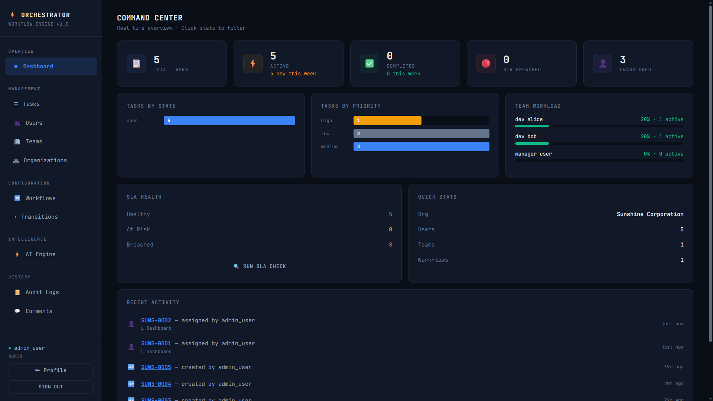

---

## 📌 Table of Contents

- [Why This Project Is Different](#-why-this-project-is-different)
- [What This Project Does](#-what-this-project-does)
- [Tech Stack](#-tech-stack)
- [System Architecture](#-system-architecture)
- [Database Design (8 Interconnected Models)](#-database-design-8-interconnected-models)
- [Backend Deep Dive](#-backend-deep-dive)
- [AI Engine — The Intelligence Layer](#-ai-engine--the-intelligence-layer)
- [JWT Authentication — How It Works](#-jwt-authentication--how-it-works)
- [Complete API Documentation](#-complete-api-documentation)
- [Django Admin Panel](#-django-admin-panel)
- [DRF Browsable API](#-drf-browsable-api)
- [Frontend Dashboard](#-frontend-dashboard)
- [Getting Started (Step-by-Step)](#-getting-started-step-by-step)
- [Project Structure](#-project-structure)
- [Error Handling](#-error-handling)
- [Configuration Reference](#-configuration-reference)
- [How to Integrate This Into Your Own Project](#-how-to-integrate-this-into-your-own-project)
- [Screenshots](#-screenshots)
- [Contributing](#-contributing)
- [License](#-license)

---

## 🏆 Why This Project Is Different

This is not a tutorial project or a simple CRUD application. Every layer of this system was designed with the same engineering principles used at product companies. Here's what makes it stand out:

### Real System Design, Not Just Endpoints

Most backend projects expose a few REST endpoints that create and read data — essentially a database with an HTTP wrapper. This project implements a **complete workflow orchestration system** with 8 interconnected database models, 20+ API endpoints with filtering, pagination, and search capabilities, and a layered architecture that separates HTTP handling from business logic from data access. The API supports complex queries like "give me all high-priority bugs assigned to the backend team, sorted by AI priority score, page 2" — in a single request.

### Configurable State Machine with Business Rule Enforcement

At the core of this engine is a **finite state machine** — the same design pattern used in payment processing systems, order management platforms, and CI/CD pipelines. Workflows are not hardcoded — organizations can define their own states (e.g., `open → in_progress → review → testing → done`), their own transition rules (e.g., only managers can approve tasks from review to testing), and their own business constraints (e.g., a task cannot move to "in_progress" unless it is assigned to someone). The engine validates **5 separate rules** before allowing any state change, and every transition is permanently recorded in an immutable audit log.

### Dual-Layer Role-Based Access Control (RBAC)

Authorization is enforced at **two independent levels** — a pattern called defense in depth. The first layer operates at the API level: it controls which endpoints each role can access (e.g., only admins can delete tasks). The second layer operates at the business logic level: even if a user has API access to update a task, the state machine independently checks whether their role permits the specific state transition they're attempting. An engineer might be able to update task fields, but the state machine will still block them from moving a task from "review" to "done" because that transition requires a manager or admin role. This dual enforcement means the system remains secure even if one layer is bypassed.

### AI-Powered Intelligence Layer (Zero Cost, Fully Local)

The AI engine runs entirely on the local machine with no paid APIs, no cloud ML services, and no subscriptions. It includes a **multi-factor priority scoring engine** that analyzes 5 weighted signals (urgency keywords, task type, manual priority, deadline proximity, and task age) to produce an explainable priority score between 0.0 and 1.0 — along with a human-readable explanation of what drove the score. It includes an **intelligent task routing system** that ranks engineers by matching task requirements against their skills (40% weight), current workload (30%), and historical performance on similar task types (30%). And it includes a **natural language query engine** that converts plain English questions like "show me all critical bugs assigned to alice" into precise database queries using regex pattern matching with word boundary detection to avoid false matches.

### Enterprise-Grade Audit Trail

Every action in the system — task creation, state transitions, assignments, comments, SLA breaches — is recorded in an **immutable audit log** with the exact old value, new value, who performed the action, when, and why. These logs cannot be modified or deleted through the API, not even by administrators. This is the same approach used by systems that need to comply with regulations like SOX, HIPAA, or GDPR, where a complete and tamper-proof history of data changes is mandatory.

### Multi-Tenant Data Isolation

Every database query in the system is automatically filtered by organization. A user from Organization A can never see, modify, or even discover the existence of data belonging to Organization B — even if they know the exact UUID of a resource. This multi-tenancy pattern is how SaaS platforms like Slack, Jira, and Salesforce keep customer data completely separated within a shared infrastructure.

### Production-Ready Authentication

The system uses **JWT (JSON Web Token) authentication** with the complete token lifecycle: login returns an access token (1-hour expiry) and a refresh token (7-day expiry), expired access tokens can be renewed using the refresh token without re-entering credentials, refresh tokens are rotated on each use (old ones become invalid), and logout permanently blacklists the refresh token so it can never be reused. This is the exact same authentication pattern used by every modern API — from GitHub to Stripe to Google.

### SLA Monitoring and Breach Detection

Tasks can have deadlines, and the system actively monitors them. The SLA service identifies tasks that have breached their deadline, flags tasks that are at risk (less than 24 hours remaining), calculates breach rates per organization, and logs every breach as an audit event. This can be triggered via API, CLI command, or scheduled as a background job — simulating how production systems use tools like Celery Beat for periodic health checks.
---

## 🧠 What This Project Does

This is the **brain behind a work management system** — the backend engine that decides what work exists, who can do what with it, what state it's in, whether the rules allow a change, and what happens when that change occurs.

Every task in this system lives inside a **state machine**. It doesn't just store data — it enforces behavior. You can't close a task that hasn't been reviewed. You can't start work on something nobody owns. You can't approve something if your role doesn't permit it. The system knows the rules and enforces them before any human error can slip through.

On top of this rule engine sits an **AI layer that thinks about your work for you.** It reads a task's title, description, type, deadline, and age — then scores its true priority across 5 weighted factors, even if the creator marked it as "low." It looks at your team's skills, current workload, and track record — then tells you exactly who should handle it and why. And when a manager asks "show me all overdue bugs assigned to the backend team," it understands the question and returns the answer — no filters, no dropdowns, just plain English.

Every action — every state change, every assignment, every comment — is permanently recorded in an immutable audit trail with before-and-after snapshots. Not even an admin can erase history. The system remembers everything.

**In short:** Tasks come in. The engine routes them, enforces rules, tracks deadlines, scores priority, recommends assignments, logs everything, and makes sure nothing falls through the cracks.

---


## 🔧 Zero-Code Organization Setup — The Heart of This Engine

This is what makes this project **production-ready for any company**. No code changes. No editing Python files. No redeployment. A new organization can set up their entire system — custom roles, priorities, task types, workflows, and admin account — with **a single API call**.

Every piece of configuration that most systems hardcode into their source code is **fully dynamic** in this engine:

| What's Dynamic | Example | How It's Configured |
|---|---|---|
| **Roles** | `admin`, `delivery_manager`, `tech_lead`, `developer`, `qa_engineer` | Defined per organization via API or admin panel |
| **Priority Levels** | `p0_blocker`, `p1_critical`, `p2_major`, `p3_minor` | Defined per organization — not locked to critical/high/medium/low |
| **Task Types** | `user_story`, `defect`, `spike`, `tech_debt`, `change_request` | Defined per organization — not locked to bug/feature/task |
| **Workflow States** | `backlog → sprint_ready → in_dev → code_review → qa → uat → deployed` | Fully configurable per workflow |
| **Transition Rules** | "Only `tech_lead` and above can move tasks from `code_review` to `qa`" | Created via API — no code needed |
| **Teams, Users, Tasks** | Everything else | All managed via API endpoints |

### Why This Matters

Most workflow tools force you into their terminology — their states, their roles, their priority names. If your company calls priorities "P0/P1/P2/P3" instead of "Critical/High/Medium/Low," you're stuck. If your engineering team uses roles like "Staff Engineer" and "Principal" instead of "Engineer" and "Manager," you have to fork the code and modify it.

**This engine adapts to your company.** Your company doesn't adapt to the engine.

### One-Click Setup API

The `/api/v1/setup/` endpoint creates everything a new organization needs in a single request:

**What it creates automatically:**
- Organization with custom roles, priorities, and task types
- Admin user with JWT tokens (ready to use immediately)
- Default workflow with the states you define
- Auto-generated transition rules (sequential flow + revert + cancellation + reopen)
- Optional team with the admin as lead

### Example 1 — Enterprise Engineering Team

A large engineering division wants an agile delivery workflow with custom roles and P0-P3 priority levels:
```json
POST /api/v1/setup/

{
    "org_name": "NovaSphere Engineering",
    "org_slug": "novasphere",
    "admin_username": "nova_admin",
    "admin_password": "securepass2026",
    "admin_email": "admin@novasphere.io",
    "roles": [
        "admin",
        "delivery_manager",
        "tech_lead",
        "developer",
        "qa_engineer",
        "viewer"
    ],
    "priorities": ["p0_blocker", "p1_critical", "p2_major", "p3_minor"],
    "task_types": ["defect", "user_story", "spike", "tech_debt", "change_request"],
    "workflow_name": "Agile Delivery Pipeline",
    "workflow_states": [
        "backlog",
        "sprint_ready",
        "in_development",
        "code_review",
        "qa_testing",
        "uat",
        "deployed",
        "cancelled"
    ],
    "initial_state": "backlog",
    "final_states": ["deployed", "cancelled"],
    "team_name": "Platform Engineering"
}
```

**Response — everything ready to use:**
```json
{
    "message": "Organization 'NovaSphere Engineering' created successfully!",
    "organization": {
        "id": "a1b2c3d4-...",
        "name": "NovaSphere Engineering",
        "slug": "novasphere",
        "allowed_roles": ["admin", "delivery_manager", "tech_lead", "developer", "qa_engineer", "viewer"],
        "allowed_priorities": ["p0_blocker", "p1_critical", "p2_major", "p3_minor"],
        "allowed_task_types": ["defect", "user_story", "spike", "tech_debt", "change_request"]
    },
    "admin_user": {
        "id": "e5f6g7h8-...",
        "username": "nova_admin",
        "role": "admin"
    },
    "workflow": {
        "id": "i9j0k1l2-...",
        "name": "Agile Delivery Pipeline",
        "states": ["backlog", "sprint_ready", "in_development", "code_review", "qa_testing", "uat", "deployed", "cancelled"],
        "initial_state": "backlog",
        "final_states": ["deployed", "cancelled"],
        "transitions_created": 15
    },
    "team": {
        "id": "m3n4o5p6-...",
        "name": "Platform Engineering"
    },
    "tokens": {
        "access": "eyJhbGciOiJIUzI1NiIs...",
        "refresh": "eyJhbGciOiJIUzI1NiIs..."
    }
}
```

The admin can immediately use the `access` token to start creating users, assigning roles, and managing tasks — zero additional setup.

### Example 2 — Small Startup (Minimal Setup)

A 5-person startup wants something simple — just three priorities, four roles, and a lightweight workflow:
```json
POST /api/v1/setup/

{
    "org_name": "CloudPeak Labs",
    "org_slug": "cloudpeak",
    "admin_username": "ceo_sarah",
    "admin_password": "launchday2026",
    "roles": ["admin", "lead", "dev", "intern"],
    "priorities": ["urgent", "normal", "someday"],
    "task_types": ["feature", "bugfix", "chore"],
    "workflow_states": ["todo", "building", "review", "shipped", "dropped"],
    "initial_state": "todo",
    "final_states": ["shipped", "dropped"]
}
```

### Example 3 — IT Support Desk

A corporate IT team wants to track support tickets with escalation levels:
```json
POST /api/v1/setup/

{
    "org_name": "Meridian Corp IT",
    "org_slug": "meridian-it",
    "admin_username": "it_head",
    "admin_password": "support2026secure",
    "roles": ["admin", "supervisor", "l2_support", "l1_support", "requester"],
    "priorities": ["sev1_outage", "sev2_degraded", "sev3_minor", "sev4_cosmetic"],
    "task_types": ["incident", "service_request", "change", "problem"],
    "workflow_name": "ITIL Incident Flow",
    "workflow_states": [
        "reported",
        "triaged",
        "investigating",
        "pending_vendor",
        "resolved",
        "closed"
    ],
    "initial_state": "reported",
    "final_states": ["resolved", "closed"],
    "team_name": "L2 Support Team"
}
```

### After Setup — What Comes Next

Once the organization is created, the admin uses their JWT tokens to:

1. **Create users** → `POST /api/v1/users/` with any role from the org's `allowed_roles`
2. **Create teams** → `POST /api/v1/teams/` and assign members
3. **Create tasks** → `POST /api/v1/tasks/` with priorities and types from the org's config
4. **Manage workflows** → Add more transition rules via `POST /api/v1/transitions/`
5. **Use the dashboard** → Login at `http://your-server/` to see everything visually

All validation is automatic — if a user tries to create a task with a priority that doesn't exist in their org's config, the API returns:
```json
{
    "priority": "Invalid priority 'critical'. Allowed: ['p0_blocker', 'p1_critical', 'p2_major', 'p3_minor']"
}
```

The system guides users toward the correct values without anyone reading documentation.

### Configuration via Admin Panel

Organizations can also be configured through Django's admin panel at `/admin/`. The Organization edit page shows three editable JSON fields — `allowed_roles`, `allowed_priorities`, and `allowed_task_types` — that can be modified at any time.

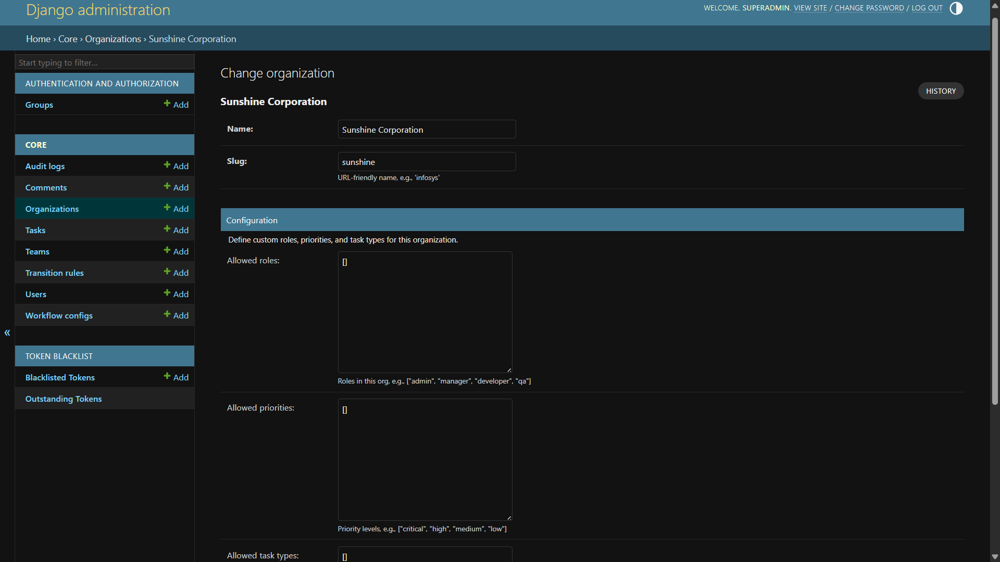
<br>
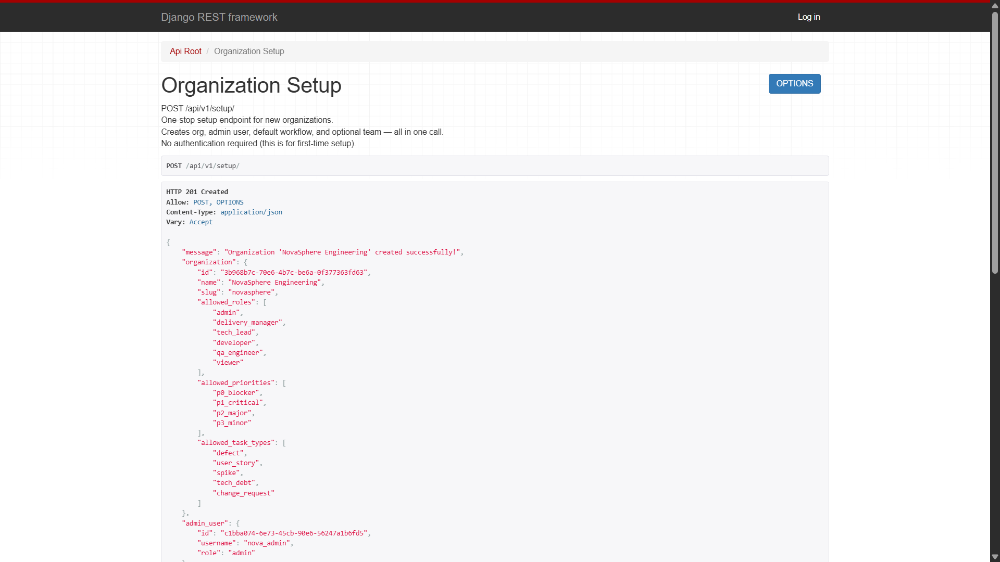
<br>
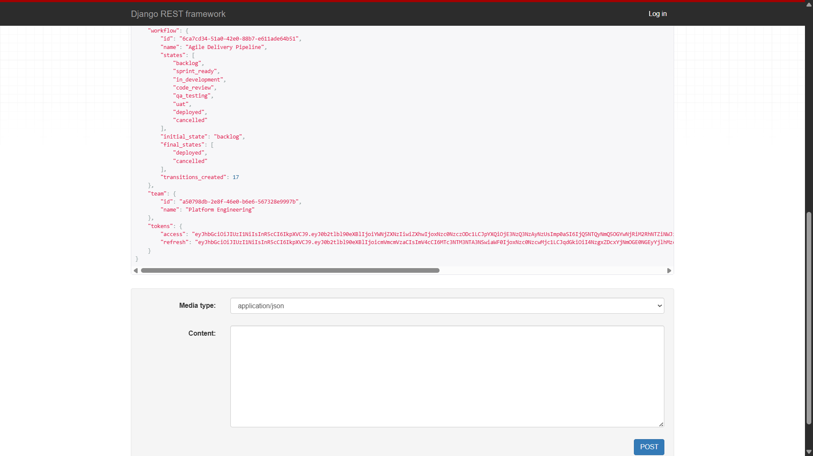
<br>
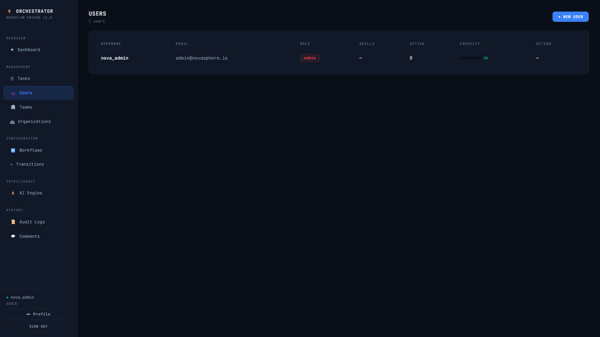
<br>
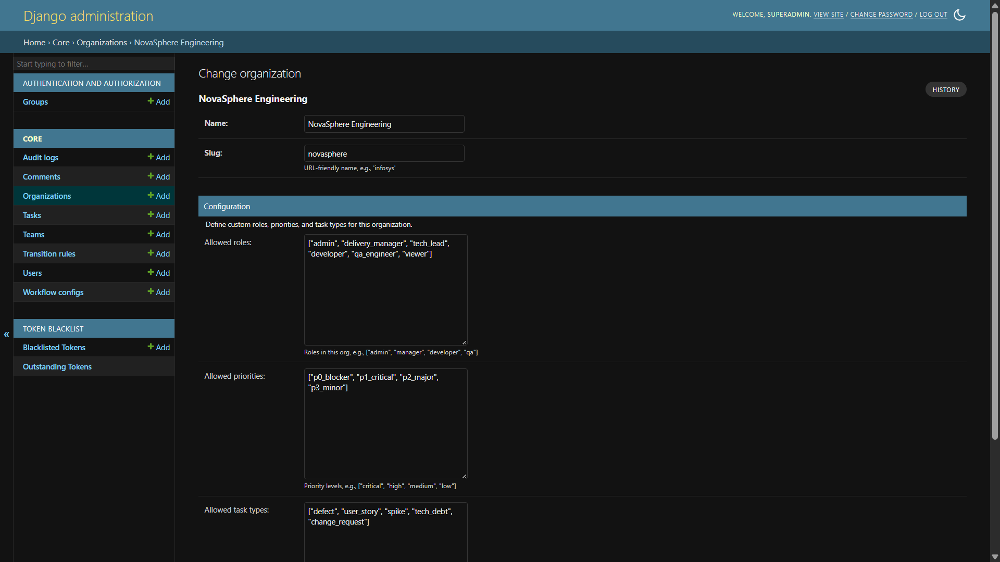

---

## 🛠 Tech Stack

| Layer | Technology | Why This Choice |
|---|---|---|
| **Backend Framework** | Django 5.x | Battle-tested, built-in ORM, admin panel, migrations — used by Instagram, Pinterest, Mozilla |
| **API Layer** | Django REST Framework | Industry standard for building RESTful APIs in Python |
| **Database** | PostgreSQL | The most advanced open-source relational database — used by every major product company |
| **Authentication** | SimpleJWT | JSON Web Token auth with access/refresh token pattern — the modern standard for API auth |
| **AI/ML** | scikit-learn, NLTK | Lightweight ML libraries — no expensive GPU or paid API needed |
| **API Filtering** | django-filter | Declarative filtering on API endpoints |
| **CORS** | django-cors-headers | Allows frontend to communicate with backend across different origins |
| **Secrets Management** | python-dotenv | Environment variables for sensitive config — never commit passwords to Git |

> **📝 A Note on the Frontend:** This is a backend-focused project. The frontend dashboard was built purely to demonstrate the backend's capabilities visually — it is written entirely in a **single HTML file** (`frontend/dashboard.html`) using vanilla HTML, CSS, and JavaScript with zero build tools, zero frameworks, and zero dependencies. This was intentional. Developers integrating this engine can **replace, modify, or completely remove** the frontend without affecting any backend functionality. The backend API is the product — the frontend is just a window into it.

---

## 🏗 System Architecture

```
┌─────────────────────────────────────────────────────────────────────┐
│                        CLIENT LAYER                                 │
│   ┌──────────────┐   ┌──────────────┐   ┌──────────────────────┐    │
│   │   Frontend   │   │   DRF        │   │   Any External App   │    │
│   │   Dashboard  │   │   Browsable  │   │   (Mobile, CLI,      │    │
│   │   (HTML/JS)  │   │   API        │   │    Postman, curl)    │    │
│   └──────┬───────┘   └──────┬───────┘   └──────────┬───────────┘    │
└──────────┼──────────────────┼──────────────────────┼───────────────-┘
           ▼                  ▼                       ▼
    ┌──────────────────────────────────────────────────────────┐
    │              JWT AUTHENTICATION LAYER                    │
    │     Access Token (1 hour) + Refresh Token (7 days)       │
    │         Token Rotation + Blacklisting on Logout          │
    └────────────────────────┬─────────────────────────────────┘
                             ▼
    ┌──────────────────────────────────────────────────────────┐
    │                    API LAYER (20+ REST Endpoints)        │
    │  /tasks/ /users/ /teams/ /workflows/ /transitions/       │
    │  /comments/ /audit-logs/ /dashboard/ /ai/                │
    └────────────────────────┬─────────────────────────────────┘
                             ▼
    ┌──────────────────────────────────────────────────────────┐
    │               PERMISSION LAYER (Dual RBAC)               │
    │  Layer 1: API Level — "Can this user hit this endpoint?" │
    │  Layer 2: Business — "Can this role do this action?"     │
    └────────────────────────┬─────────────────────────────────┘
                             ▼
    ┌──────────────────────────────────────────────────────────┐
    │                  SERVICE LAYER                           │
    │  StateMachineService │ SLAService │ DashboardService     │
    └────────────────────────┬─────────────────────────────────┘
                             ▼
    ┌──────────────────────────────────────────────────────────┐
    │                   AI ENGINE                              │
    │  PriorityScorer │ TaskRouter │ NLQueryEngine             │
    └────────────────────────┬─────────────────────────────────┘
                             ▼
    ┌──────────────────────────────────────────────────────────┐
    │                   DATA LAYER (8 Models)                  │
    │  Organization │ User │ Team │ WorkflowConfig             │
    │  TransitionRule │ Task │ Comment │ AuditLog              │
    └────────────────────────┬─────────────────────────────────┘
                             ▼
                    ┌─────────────────┐
                    │   PostgreSQL    │
                    └─────────────────┘
```

---

## 🗄 Database Design (8 Interconnected Models)

All models use **UUIDs** as primary keys instead of auto-incrementing integers — this is a security best practice because sequential IDs leak information.

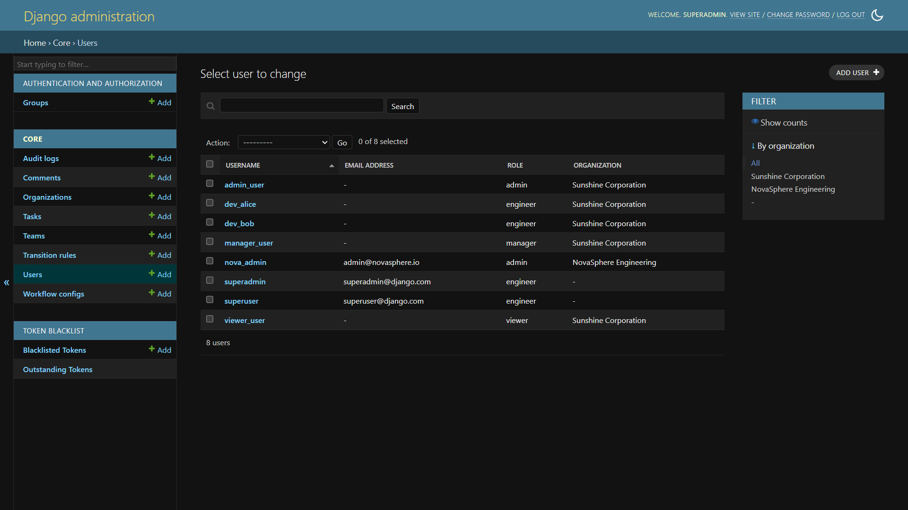

### Model Relationships

```
Organization (1)
  ├── has many → User (N)
  │               ├── created → Task (N)
  │               ├── assigned to → Task (N)
  │               ├── leads → Team (N)
  │               └── performed → AuditLog (N)
  ├── has many → Team (N)
  │               └── has many → Task (N)
  ├── has many → WorkflowConfig (N)
  │               └── has many → TransitionRule (N)
  └── has many → Task (N)
                  ├── has many → Comment (N)
                  └── has many → AuditLog (N)
```

### Key Model Details

**Organization** — Top-level entity. Every piece of data belongs to an organization (multi-tenancy). Fields: `id` (UUID), `name`, `slug` (used for task key prefix like SUNS-0001).

**User** — Extends Django's built-in user. Fields: `role` (admin/manager/engineer/viewer), `skills` (JSON array like `["python", "django"]`), `max_concurrent_tasks` (workload limit, default 5).

**WorkflowConfig** — Defines the state machine. Fields: `allowed_states` (JSON array), `initial_state`, `final_states` (JSON array). Example: states `["open", "in_progress", "review", "testing", "done", "cancelled"]` with initial `"open"` and finals `["done", "cancelled"]`.

**TransitionRule** — Controls who can move tasks between states. Fields: `from_state`, `to_state`, `allowed_roles` (JSON array). Example: `from: "review"`, `to: "testing"`, `roles: ["admin", "manager"]`.

**Task** — Core work item. Fields: `task_key` (auto-generated like SUNS-0001), `current_state`, `priority`, `task_type`, `tags` (JSON), `due_date`, `sla_breached`, `ai_priority_score`, `ai_estimated_hours`, `resolved_at`.

**AuditLog** — Immutable record. Fields: `action` (created/state_changed/assigned/commented/sla_breached), `old_value` (JSON), `new_value` (JSON), `reason`. Cannot be edited or deleted via API.

---

## 🔧 Backend Deep Dive

### 1. Design Patterns Used

**State Machine Pattern** — The `StateMachineService` acts as a finite automaton controller. Tasks can only transition between states that are explicitly defined in `TransitionRule`.

**Service Layer Pattern** — Business logic is separated from views into dedicated service classes. Views only handle HTTP request/response. This makes the code testable, reusable, and maintainable.

**Repository Pattern** (via Django ORM) — Database queries are abstracted through Django's ORM. The code never writes raw SQL.

**Serializer Pattern** (via DRF) — Separate serializers for different use cases: `TaskListSerializer` (lightweight, for list views) vs `TaskDetailSerializer` (full data, for single task views).

### 2. State Machine Engine

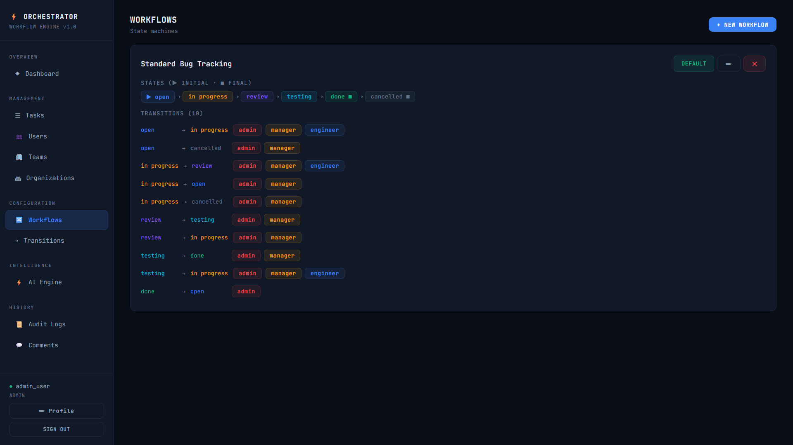

**How a transition works internally:**

```
User: POST /tasks/{id}/transition/ {"to_state": "in_progress"}
                    │
                    ▼
  Check 1: Same state? → FAIL
  Check 2: Valid state in workflow? → FAIL
  Check 3: Transition rule exists? → FAIL
  Check 4: User role allowed? → FAIL
  Check 5: Task assigned? (if going to in_progress) → FAIL
                    │
              ALL PASSED ✅
                    │
  → Update task.current_state
  → Set resolved_at if final state
  → Create AuditLog entry
  → Return updated task
```

**Default Workflow:**

```
  [OPEN] → [IN_PROGRESS] → [REVIEW] → [TESTING] → [DONE]
    │           │                                      │
    ▼           ▼                                      ▼
 [CANCELLED] [CANCELLED]                     [OPEN] (reopen, admin only)
```

### 3. Role-Based Access Control (RBAC)

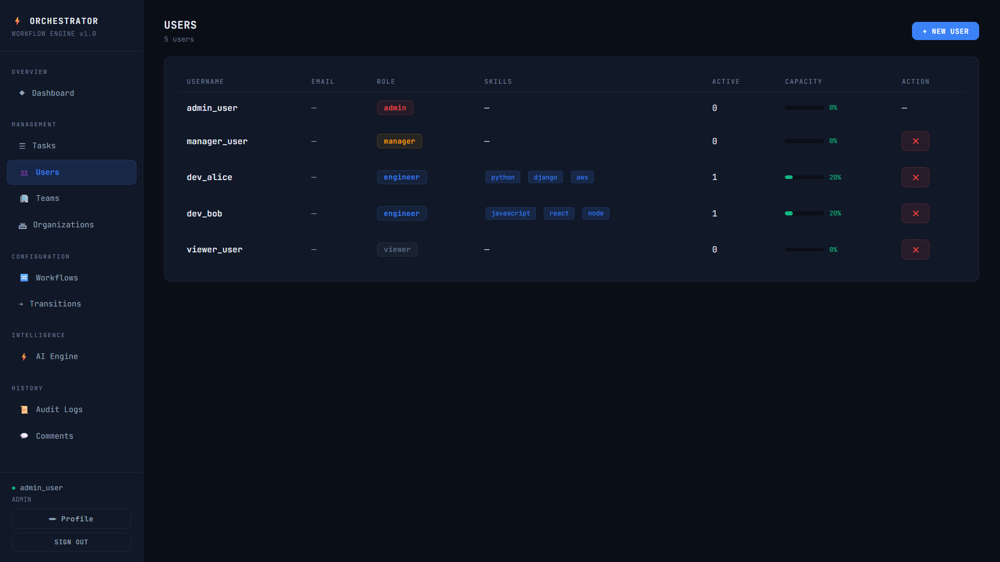

**Layer 1 — API Endpoint Level:**

| Action | Admin | Manager | Engineer | Viewer |
|---|:---:|:---:|:---:|:---:|
| View tasks/users/teams | ✅ | ✅ | ✅ | ✅ |
| Create tasks | ✅ | ✅ | ✅ | ❌ |
| Update any task in org | ✅ | ✅ | ❌ | ❌ |
| Delete tasks | ✅ | ❌ | ❌ | ❌ |
| Create users | ✅ | ✅ | ❌ | ❌ |
| Manage workflows/transitions | ✅ | ❌ | ❌ | ❌ |

*Managers can create all roles except Admin.*

**Layer 2 — Business Logic Level (State Transitions):**

| Transition | Admin | Manager | Engineer |
|---|:---:|:---:|:---:|
| open → in_progress | ✅ | ✅ | ✅ |
| open → cancelled | ✅ | ✅ | ❌ |
| in_progress → review | ✅ | ✅ | ✅ |
| review → testing | ✅ | ✅ | ❌ |
| testing → done | ✅ | ✅ | ❌ |
| done → open (reopen) | ✅ | ❌ | ❌ |

**Why two layers?** An engineer might have API access to "update a task" (Layer 1), but the state machine still prevents them from moving a task from "review" to "done" (Layer 2). This is **defense in depth**.

### 4. Immutable Audit Trail

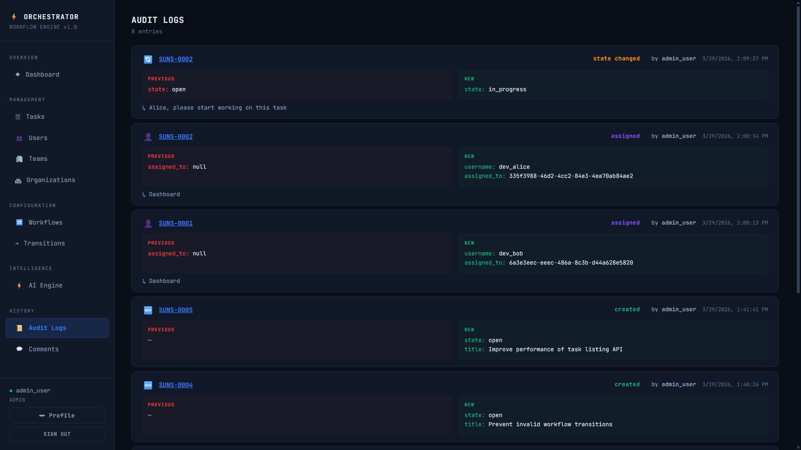

Every action creates an `AuditLog` with: what happened, who did it, when, what changed (old → new as JSON), and why. Audit logs are **read-only** — no update or delete operations exist, not even for admins.

### 5. SLA Breach Detection

Tasks with a `due_date` are monitored. The `SLAService` flags overdue tasks as `sla_breached = True`, identifies at-risk tasks (< 24 hours remaining), and creates audit entries for each breach. Triggerable via API or CLI command.

---

## 🤖 AI Engine — The Intelligence Layer

Runs entirely locally — no paid APIs, no cloud services, no subscriptions.

### 1. Priority Scoring (5 Weighted Factors)

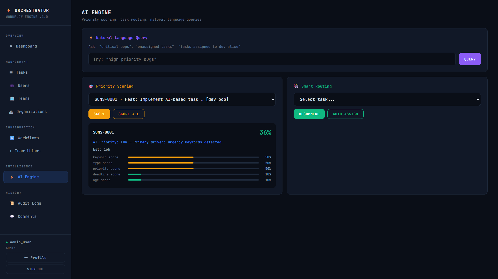

The AI evaluates the task and assigns a priority score, which is then reflected on the task for better decision-making.

| Factor | Weight | Example |
|---|---|---|
| **Keyword analysis** | 35% | "crash", "security", "blocker" → high score |
| **Task type** | 15% | Bugs score 0.8, features score 0.5 |
| **Manual priority** | 15% | Aligns with human-set priority |
| **Deadline proximity** | 20% | Overdue → 1.0, 24h left → 0.8, 1 week → 0.3 |
| **Task age** | 15% | Older unresolved tasks score higher |

Score interpretation: 🔴 70-100% = CRITICAL, 🟡 40-70% = MEDIUM/HIGH, 🟢 0-40% = LOW

### 2. Intelligent Task Routing

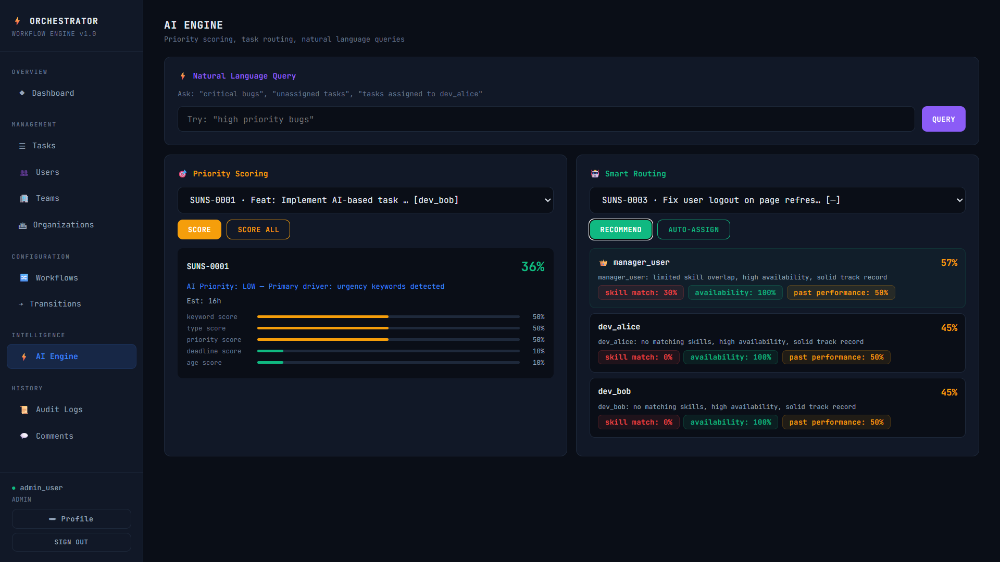

Ranks engineers by: **Skill match** (40%) — task tags vs user skills, **Workload** (30%) — fewer active tasks = higher score, **Past performance** (30%) — SLA compliance + resolution speed on similar tasks.

### 3. Natural Language Queries

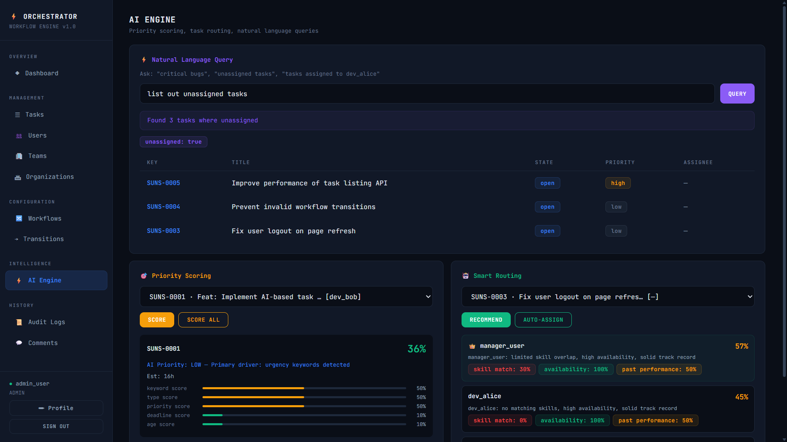

Type plain English → get database results. Examples: `"critical bugs"`, `"unassigned tasks"`, `"tasks assigned to dev_alice"`, `"overdue tasks"`, `"my tasks"`.

---

## 🔐 JWT Authentication — How It Works

JWT (JSON Web Token) is the industry-standard way to authenticate API requests. Here is a beginner-friendly explanation:

### The Problem

APIs are **stateless** — the server does not remember anything between requests. Every API call is independent. So how does the server know who you are?

### The Solution: Tokens

When you log in, the server gives you two tokens — think of them as temporary ID cards:

**Access Token** — Your main ID card. You show it with every request. It expires in 1 hour for security. If someone steals it, they can only use it for 1 hour.

**Refresh Token** — A backup card to get a new access token without logging in again. It lasts 7 days.

### How It Works Step-by-Step

```
Step 1: LOGIN
   You send: POST /auth/login/ {"username": "admin_user", "password": "testpass123"}
   Server returns: {"access": "eyJhbG...", "refresh": "eyJhbG..."}

Step 2: USE THE ACCESS TOKEN
   You send: GET /tasks/
   Header: Authorization: Bearer eyJhbG...
   Server decodes the token → finds your user ID → returns your tasks

Step 3: TOKEN EXPIRES (after 1 hour)
   You send: POST /auth/refresh/ {"refresh": "eyJhbG..."}
   Server returns: {"access": "NEW_TOKEN_HERE"}

Step 4: LOGOUT
   You send: POST /auth/logout/ {"refresh": "eyJhbG..."}
   Server blacklists the refresh token → it can never be used again
```

### Authentication Endpoints

| Endpoint | Method | Who Can Access | What It Does |
|---|---|---|---|
| `/auth/login/` | POST | Anyone (no token needed) | Send username + password, get tokens |
| `/auth/register/` | POST | Anyone (no token needed) | Create account + get tokens |
| `/auth/refresh/` | POST | Anyone with valid refresh token | Get new access token |
| `/auth/logout/` | POST | Logged-in users | Blacklist refresh token permanently |

---

## 📡 Complete API Documentation

**Base URL:** `http://127.0.0.1:8000/api/v1/`

### How to Read This Documentation

- **`{id}`** means a UUID. You get UUIDs from list endpoints. For example, to get a task's `{id}`, first call `GET /tasks/` — each task in the response has an `"id"` field like `"4709a29f-d408-4536-8586-e9cbb5dcc1d0"`. Copy that UUID and use it in the URL.
- **Permission: Manager+** means the endpoint requires the `manager` role or higher (`admin`). The `+` means "this role and above." So `Manager+` = Manager or Admin. `Engineer+` = Engineer, Manager, or Admin.
- **Permission: Authenticated** means any logged-in user (all 4 roles) can access it.

### Organizations

| Endpoint | Method | Permission | Description |
|---|---|---|---|
| `/organizations/` | GET | Authenticated | List organizations (users see only their own) |
| `/organizations/` | POST | Admin | Create organization. Body: `{"name": "...", "slug": "..."}` |
| `/organizations/{id}/` | GET | Authenticated | Get single organization |
| `/organizations/{id}/` | PATCH | Admin | Update organization |
| `/organizations/{id}/` | DELETE | Admin | Delete organization |

### Users

| Endpoint | Method | Permission | Description |
|---|---|---|---|
| `/users/` | GET | Authenticated | List all users in your org |
| `/users/` | POST | Manager+ | Create user. Body: `{"username", "password", "email", "role", "organization", "skills"}` |
| `/users/me/` | GET | Authenticated | Get your own profile |
| `/users/{id}/` | GET | Authenticated | Get user details |
| `/users/{id}/` | PATCH | Authenticated | Update user (email, skills, max_concurrent_tasks) |
| `/users/{id}/` | DELETE | Admin | Delete user |

**Where to get the organization UUID for creating a user:** Call `GET /organizations/` first — each org in the response has an `"id"` field.

### Teams

| Endpoint | Method | Permission | Description |
|---|---|---|---|
| `/teams/` | GET | Authenticated | List teams |
| `/teams/` | POST | Manager+ | Create team. Body: `{"name", "organization", "lead", "members"}` |
| `/teams/{id}/` | PATCH | Manager+ | Update team |
| `/teams/{id}/` | DELETE | Manager+ | Delete team |

### Workflows

| Endpoint | Method | Permission | Description |
|---|---|---|---|
| `/workflows/` | GET | Authenticated | List workflows with all transition rules nested |
| `/workflows/` | POST | Admin | Create workflow. Body: `{"name", "organization", "allowed_states", "initial_state", "final_states"}` |
| `/workflows/{id}/` | PATCH | Admin | Update workflow |
| `/workflows/{id}/` | DELETE | Admin | Delete workflow |

### Transition Rules

| Endpoint | Method | Permission | Description |
|---|---|---|---|
| `/transitions/` | GET | Authenticated | List all transition rules |
| `/transitions/` | POST | Admin | Create rule. Body: `{"workflow", "from_state", "to_state", "allowed_roles"}` |
| `/transitions/{id}/` | DELETE | Admin | Delete rule |

### Tasks (The Core)

| Endpoint | Method | Permission | Description |
|---|---|---|---|
| `/tasks/` | GET | Authenticated | List tasks (paginated, 20 per page) |
| `/tasks/` | POST | Engineer+ | Create task |
| `/tasks/{id}/` | GET | Authenticated | Get full task details with comments |
| `/tasks/{id}/` | PATCH | Owner or Manager+ | Update task fields |
| `/tasks/{id}/` | DELETE | Admin | Delete task |
| `/tasks/{id}/transition/` | POST | Role-dependent | Change task state (validated by state machine) |
| `/tasks/{id}/available-transitions/` | GET | Authenticated | What states can I move this task to? |
| `/tasks/{id}/assign/` | POST | Manager+ | Assign task to a user |

**Filtering, searching, sorting (all combinable):**

```
GET /tasks/?current_state=open              — Filter by state
GET /tasks/?priority=critical               — Filter by priority
GET /tasks/?team={team-uuid}                — Filter by team
GET /tasks/?assigned_to={user-uuid}         — Filter by assignee
GET /tasks/?sla_breached=true               — Only overdue tasks
GET /tasks/?search=login+bug                — Search title and task_key
GET /tasks/?ordering=-ai_priority_score     — Sort (prefix - for descending)
GET /tasks/?current_state=open&priority=high&ordering=-created_at  — Combine all
```

**Create a task:**
```json
POST /tasks/
{
    "title": "Fix login page crash on Safari",
    "description": "Users report crash when clicking login on Safari 17",
    "priority": "high",
    "task_type": "bug",
    "workflow": "<workflow-uuid — get from GET /workflows/>",
    "tags": ["frontend", "urgent"],
    "due_date": "2026-04-01T17:00:00Z"
}
```

**Transition a task (change its state):**
```
Step 1 — Check what transitions are available for your role:
GET /tasks/{task-id}/available-transitions/

Response example:
{
    "current_state": "open",
    "available_transitions": [
        {"to_state": "in_progress", "allowed_roles": ["admin", "manager", "engineer"]},
        {"to_state": "cancelled", "allowed_roles": ["admin", "manager"]}
    ]
}

Step 2 — Perform the transition:
POST /tasks/{task-id}/transition/
{
    "to_state": "in_progress",
    "reason": "Starting work on this bug"
}
```

**Assign a task:**
```
Step 1 — Get the engineer's UUID:
GET /users/
Find the user you want → copy their "id" field

Step 2 — Assign:
POST /tasks/{task-id}/assign/
{
    "user_id": "<engineer-uuid-from-step-1>",
    "reason": "Best skill match for this task"
}
```

### Comments

| Endpoint | Method | Permission | Description |
|---|---|---|---|
| `/comments/` | GET | Authenticated | List all comments |
| `/comments/` | POST | Authenticated | Add comment. Body: `{"task": "<task-uuid>", "content": "..."}` |

### Audit Logs (Read-Only — cannot be modified or deleted)

| Endpoint | Method | Permission | Description |
|---|---|---|---|
| `/audit-logs/` | GET | Authenticated | List audit logs. Filter: `?action=state_changed` or `?task={uuid}` |

### Dashboard and Analytics

| Endpoint | Method | Description |
|---|---|---|
| `/dashboard/overview/` | GET | Task counts by state/priority/type + SLA summary |
| `/dashboard/team-performance/` | GET | Per-user: active tasks, completed, SLA breaches, avg resolution time, workload % |
| `/dashboard/activity/` | GET | Recent activity feed (last 20 actions) |
| `/dashboard/sla-check/` | POST | Scan all tasks and flag SLA breaches |

### AI Engine

| Endpoint | Method | Permission | Body | Description |
|---|---|---|---|---|
| `/ai/score-priority/` | POST | Authenticated | `{"task_id": "<uuid>"}` | Score one task — returns 5-factor breakdown |
| `/ai/score-all/` | POST | Authenticated | *(none)* | Score all active tasks |
| `/ai/recommend-assignee/` | POST | Authenticated | `{"task_id": "<uuid>"}` | Get ranked engineer recommendations |
| `/ai/auto-assign/` | POST | Manager+ | `{"task_id": "<uuid>"}` | Auto-assign to best candidate |
| `/ai/query/` | POST | Authenticated | `{"question": "..."}` | Natural language search |

---

## 🛡 Django Admin Panel

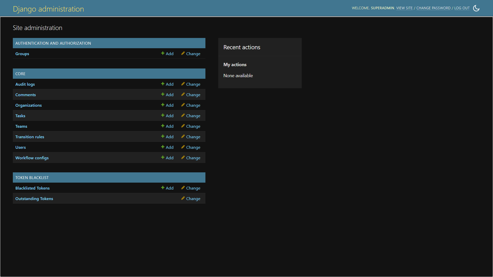

Django includes a powerful built-in admin panel at `/admin/`. This is a separate interface from the frontend dashboard — it gives you direct database access with full CRUD on all 8 models, search, filters, and inline editing.

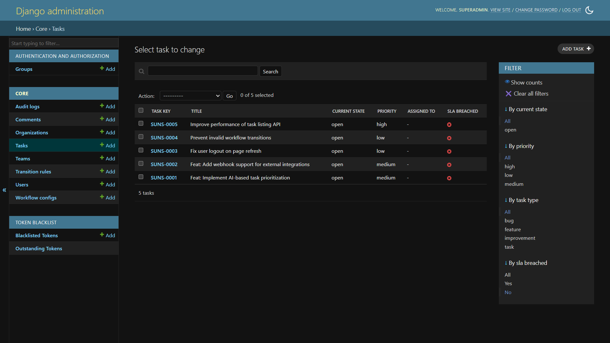
<br>
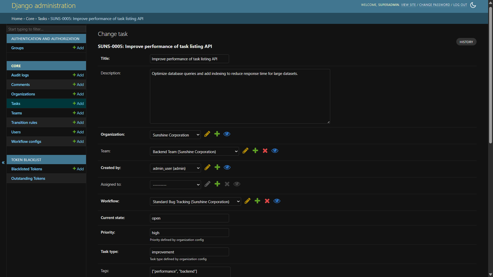

Access it at `http://127.0.0.1:8000/admin/` with your superuser credentials.

---

## 🌐 DRF Browsable API

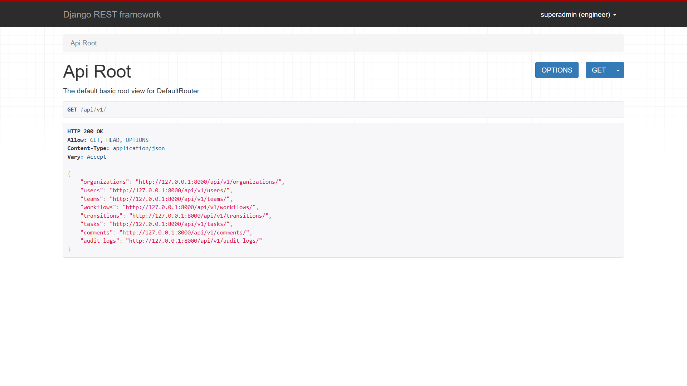

Django REST Framework provides a browser-based API interface at `/api/v1/`. You can browse all endpoints, send requests, and see formatted JSON responses — all from your browser.

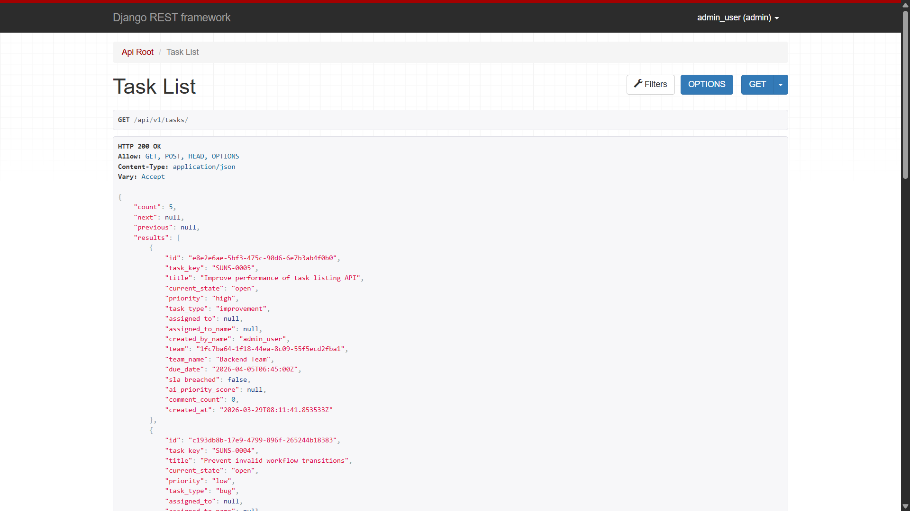
<br>
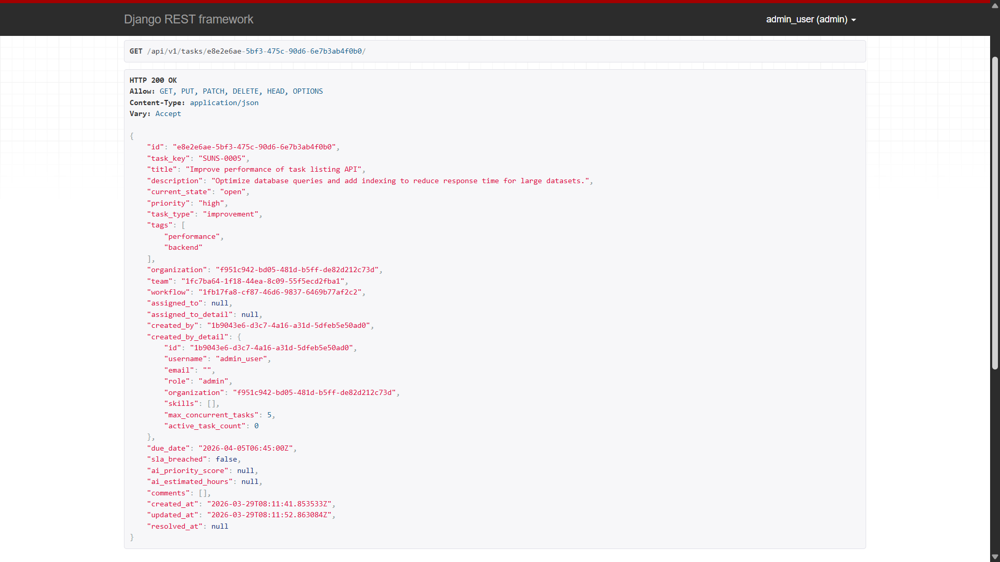

---

## 🖥 Frontend Dashboard

The frontend is a single HTML file — no React build, no npm, no webpack. It communicates with the backend via the REST API using JWT tokens.

| Page | Features |
|---|---|
| **Dashboard** | Clickable stat cards, state/priority charts, team workload, SLA health, activity feed |
| **Tasks** | Search, filter (state/priority/team), sort columns, pagination, create/edit/delete, inline AI scoring |
| **Users** | List with roles/skills/capacity bars, create/delete users |
| **Teams** | Cards with lead/members, create/edit/delete |
| **Organizations** | Details with counts, create/edit |
| **Workflows** | State machine visualization, create/edit/delete |
| **Transitions** | Rule table, create/delete |
| **AI Engine** | NL query, priority scoring, smart routing, auto-assign |
| **Audit Logs** | Card layout with old/new values, clickable task links |
| **Comments** | Sorted recent-first, clickable task navigation |

---

## 🚀 Getting Started (Step-by-Step)

### Prerequisites

| Software | Version | Download |
|---|---|---|
| Python | 3.10+ | [python.org](https://www.python.org/downloads/) |
| PostgreSQL | 14+ | [postgresql.org](https://www.postgresql.org/download/) |
| Git | Any | [git-scm.com](https://git-scm.com/downloads/) |

### Installation

```bash
# 1. Clone the repository
git clone https://github.com/adithyakrishhna/work-orchestration-engine.git
cd work-orchestration-engine

# 2. Create and activate virtual environment
python -m venv venv
# Windows: venv\Scripts\activate
# Mac/Linux: source venv/bin/activate

# 3. Install dependencies
pip install -r requirements.txt

# 4. Create .env file (see .env.example for reference)
# Add your PostgreSQL password and a secret key

# 5. Create the PostgreSQL database
psql -U postgres -c "CREATE DATABASE work_orchestration;"

# 6. Run migrations
python manage.py migrate

# 7. Create admin account
python manage.py createsuperuser

# 8. Load sample data
python manage.py seed_data

# 9. Start the server
python manage.py runserver
```

### Access Points

| URL | What You Will See |
|---|---|
| `http://127.0.0.1:8000/` | Frontend Dashboard (login page) |
| `http://127.0.0.1:8000/admin/` | Django Admin Panel |
| `http://127.0.0.1:8000/api/v1/` | DRF Browsable API |

### Test Credentials (after running seed_data)

| Username | Password | Role | What They Can Do |
|---|---|---|---|
| admin_user | testpass123 | Admin | Everything — full CRUD, all transitions, manage workflows |
| manager_user | testpass123 | Manager | Assign tasks, create users, approve/reject work |
| dev_alice | testpass123 | Engineer | Work on assigned tasks, transition own tasks |
| dev_bob | testpass123 | Engineer | Work on assigned tasks, transition own tasks |
| viewer_user | testpass123 | Viewer | Read-only access to all data |

---

## 📁 Project Structure
```
work-orchestration-engine/
├── config/                          # Project configuration
│   ├── settings.py                  # Database, auth, REST, CORS, JWT settings
│   ├── urls.py                      # Root URL routing
│   ├── wsgi.py                      # WSGI server entry point
│   └── asgi.py                      # ASGI server entry point
│
├── core/                            # Main application (backend brain)
│   ├── models.py                    # 8 database models (Organization, User, Team,
│   │                                #   WorkflowConfig, TransitionRule, Task,
│   │                                #   Comment, AuditLog)
│   ├── admin.py                     # Django admin panel configuration
│   ├── urls.py                      # Core API URL routing
│   ├── auth_urls.py                 # Auth endpoint routing (login, register, logout)
│   │
│   ├── serializers/                 # JSON ↔ Python conversion layer
│   │   ├── __init__.py              # Exports all serializers
│   │   ├── organization.py          # Org serializer with dynamic config fields
│   │   ├── user.py                  # User + UserCreate with role validation
│   │   ├── team.py                  # Team with nested lead details
│   │   ├── workflow.py              # Workflow with nested transition rules
│   │   ├── task.py                  # TaskList (light) + TaskDetail (full) with
│   │   │                            #   dynamic priority/type validation
│   │   └── audit.py                 # Read-only, immutable audit serializer
│   │
│   ├── views/                       # API endpoint handlers
│   │   ├── __init__.py              # Exports all views
│   │   ├── organization.py          # Organization CRUD
│   │   ├── user.py                  # User CRUD + /me endpoint
│   │   ├── team.py                  # Team CRUD
│   │   ├── workflow.py              # Workflow + Transition CRUD
│   │   ├── task.py                  # Task CRUD + transition + assign endpoints
│   │   ├── audit.py                 # Read-only audit log listing
│   │   ├── dashboard.py             # Analytics, SLA check, team performance
│   │   ├── auth.py                  # Register + Logout views
│   │   └── setup.py                 # One-click organization setup endpoint
│   │
│   ├── permissions/                 # Access control layer
│   │   ├── __init__.py              # Exports all permissions
│   │   └── rbac.py                  # IsAdmin, IsManagerOrAbove,
│   │                                #   IsSameOrganization, TaskPermission
│   │
│   ├── services/                    # Business logic (separated from views)
│   │   ├── __init__.py              # Exports all services
│   │   ├── state_machine.py         # transition(), assign_task(),
│   │   │                            #   get_available_transitions()
│   │   ├── sla_service.py           # check_all_sla(), get_sla_summary()
│   │   └── dashboard_service.py     # get_overview(), get_team_performance(),
│   │                                #   get_recent_activity()
│   │
│   └── management/                  # Django CLI commands
│       └── commands/
│           ├── seed_data.py         # Populate sample data for testing
│           └── check_sla.py         # Run SLA breach check from terminal
│
├── ai_engine/                       # AI/ML intelligence module
│   ├── priority_scorer.py           # 5-factor weighted priority scoring engine
│   ├── task_router.py               # Skill + workload + performance matching
│   ├── nl_query.py                  # Natural language → database query parser
│   ├── views.py                     # AI API endpoints (score, route, query)
│   └── urls.py                      # AI URL routing
│
├── frontend/
│   └── dashboard.html               # Complete SPA dashboard (single file,
│                                    #   no build tools, no frameworks)
│
├── docs/
│   └── images/                      # Screenshots for documentation
│
├── .env                             # Your secrets — gitignored, never pushed
├── .env.example                     # Template showing required env variables
├── .gitignore                       # Files excluded from Git
├── manage.py                        # Django CLI entry point
├── requirements.txt                 # Python dependencies
├── LICENSE                          # MIT License
└── README.md                        # Project documentation
```

---

## ❌ Error Handling

All errors return clear, specific messages. In the frontend, errors appear as modal popups requiring user acknowledgment.

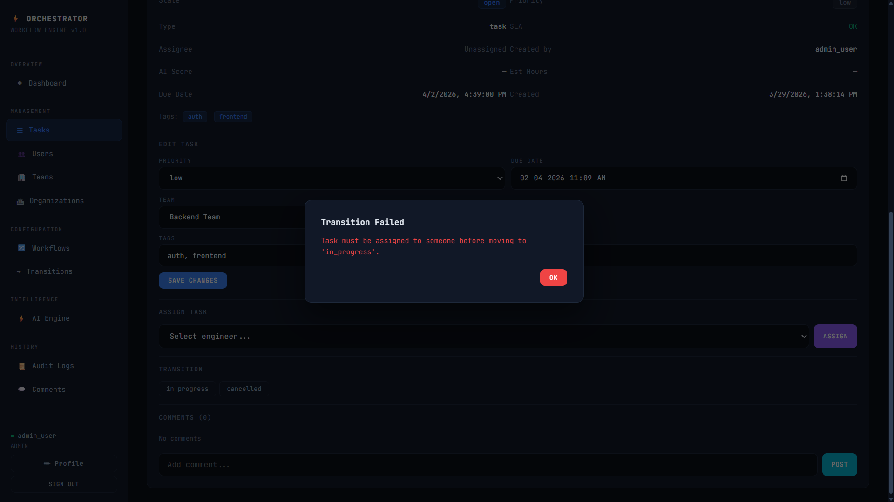

### State Machine Errors

| What You Tried | Error Message |
|---|---|
| Transition without assigning first | `"Task must be assigned to someone before moving to 'in_progress'."` |
| Invalid state path | `"Transition from 'open' to 'done' is not allowed in workflow 'Standard Bug Tracking'."` |
| Wrong role for transition | `"Your role 'engineer' cannot transition from 'review' to 'testing'. Allowed roles: ['admin', 'manager']"` |
| Already in target state | `"Task is already in 'open' state."` |
| Non-existent state | `"State 'invalid' is not valid for workflow 'Standard Bug Tracking'. Allowed states: [...]"` |

### Assignment Errors

| What You Tried | Error Message |
|---|---|
| Assign to overloaded user | `"dev_alice already has 5 active tasks (max: 5)."` |
| Assign across organizations | `"Cannot assign task to user from different organization."` |
| Engineer tries auto-assign | `"Only admins and managers can auto-assign tasks."` |

---

## ⚙ Configuration Reference

### Environment Variables (.env)

| Variable | Description |
|---|---|
| `DB_NAME` | PostgreSQL database name |
| `DB_USER` | Database username |
| `DB_PASSWORD` | Database password (**never commit this**) |
| `DB_HOST` | Database host (usually `localhost`) |
| `DB_PORT` | Database port (usually `5432`) |
| `SECRET_KEY` | Django secret key for cryptographic signing |

### Key Django Settings

| Setting | Value | Purpose |
|---|---|---|
| `ACCESS_TOKEN_LIFETIME` | 1 hour | JWT access token duration |
| `REFRESH_TOKEN_LIFETIME` | 7 days | JWT refresh token duration |
| `ROTATE_REFRESH_TOKENS` | True | New refresh token on each use |
| `BLACKLIST_AFTER_ROTATION` | True | Old refresh tokens invalidated |
| `PAGE_SIZE` | 20 | Default pagination size |

---

## 🔌 How to Integrate This Into Your Own Project

### Option 1: Use the REST API from any frontend
Any application that can make HTTP requests can use this backend — React, Vue, Angular, mobile apps, CLI tools.

### Option 2: Use as a Django app
Copy `core/` and `ai_engine/` into your Django project, add to `INSTALLED_APPS`, include URLs, run migrations.

### Option 3: Customize workflows
Create your own workflows through the API or admin panel. Define custom states, transitions, and role permissions for your specific use case (support tickets, manufacturing orders, patient tracking, etc.).

---

## 📸 Screenshots

### Backend — Django Admin Panel

<br>

<br>


### Backend — DRF Browsable API

<br>

<br>


### Frontend — Dashboard
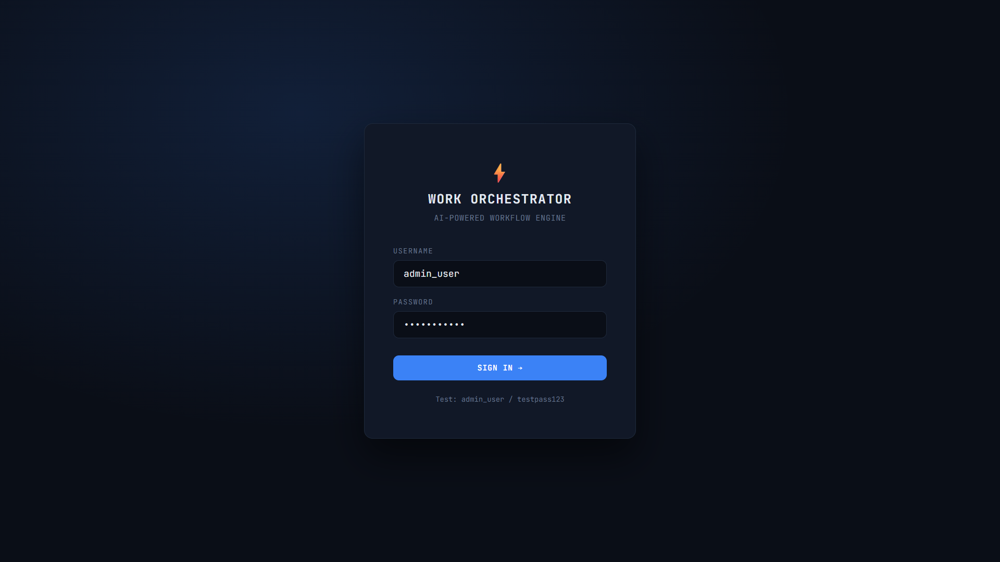
<br>


### Frontend — Task Management
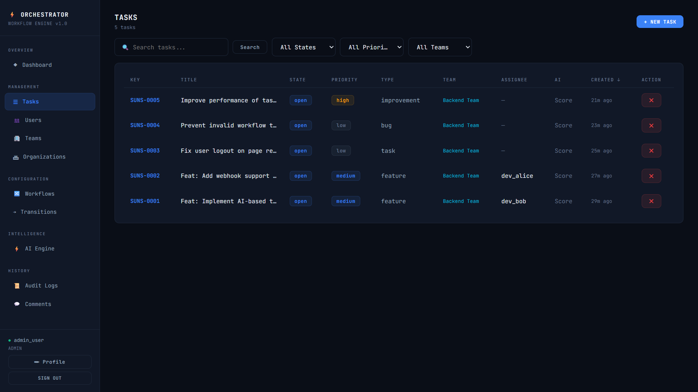
<br>
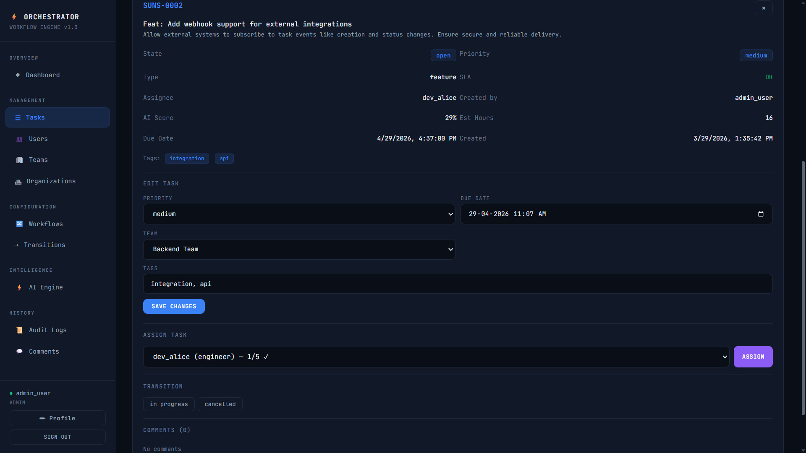
<br>
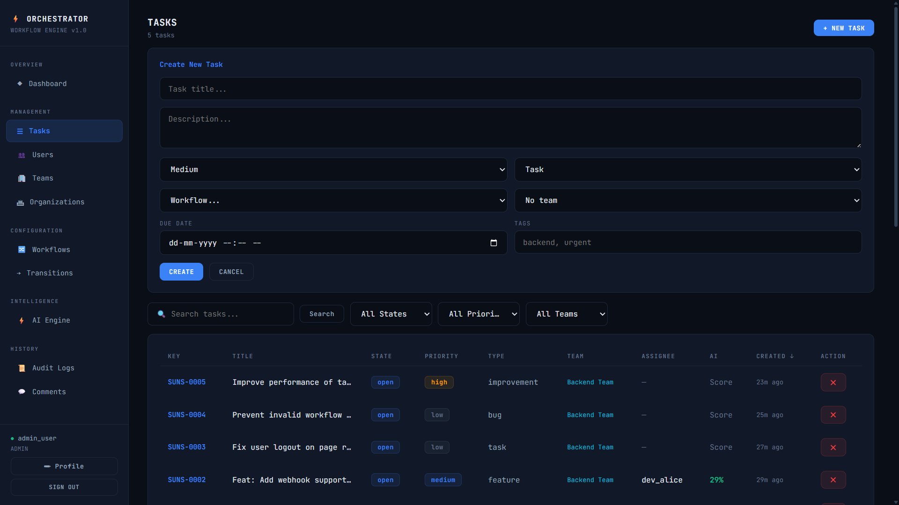
<br>
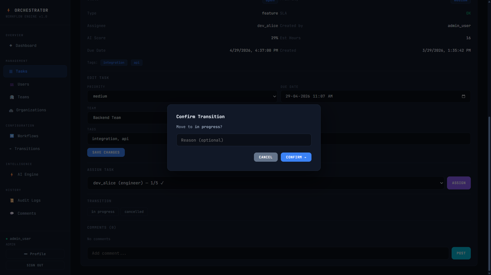

### Frontend — AI Engine

<br>

<br>


### Frontend — Management

<br>
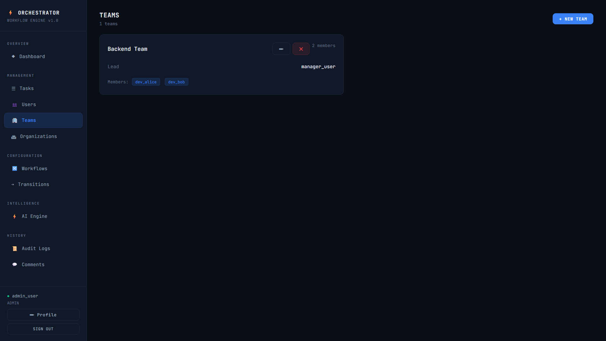
<br>
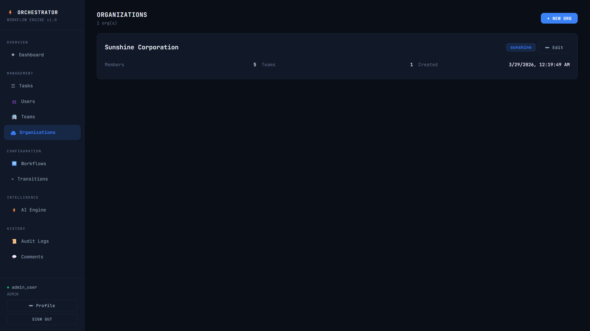
<br>

<br>
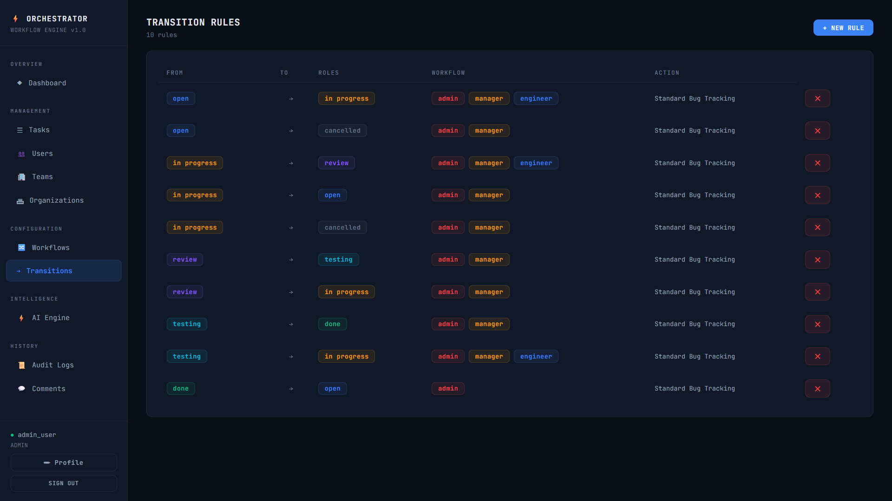

### Frontend — History and Errors

<br>
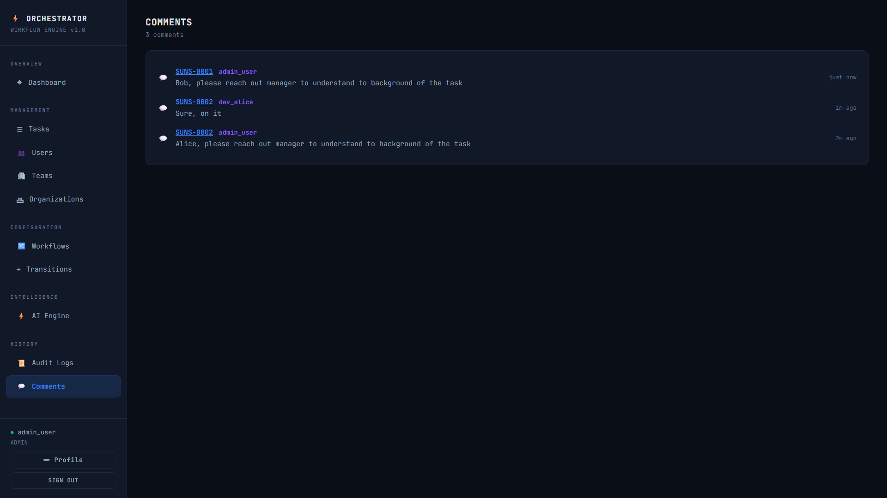
<br>

<br>
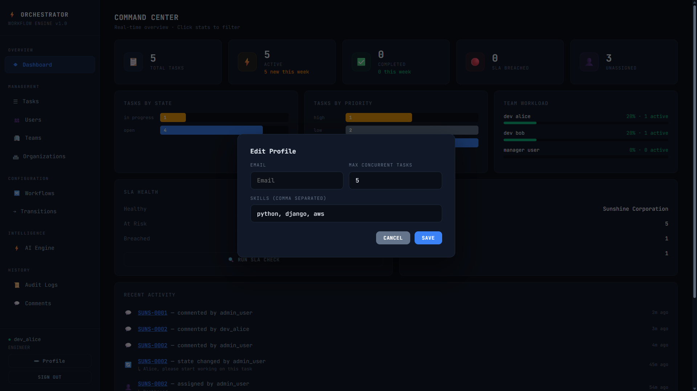
<br>
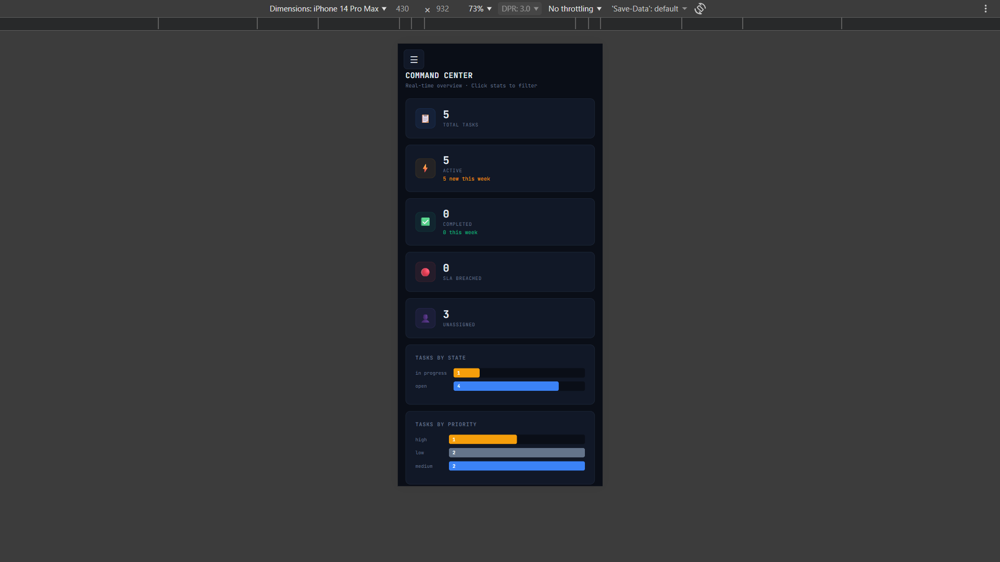

---

## 🤝 Contributing

Contributions are welcome! To get started:

1. Fork the repository  
2. Create a new branch: `git checkout -b feature/your-feature-name`  
3. Make your changes and commit: `git commit -m "feat: add your feature"`  
4. Push to your fork: `git push origin feature/your-feature-name`  
5. Open a Pull Request and describe your changes clearly  

---

## 📄 License

MIT License — see [LICENSE](LICENSE) for details.

---

**Built by [Adithya Krishna](https://github.com/adithyakrishhna)** — *⭐ Star this repo if you appreciate this production-grade backend engineering.!*