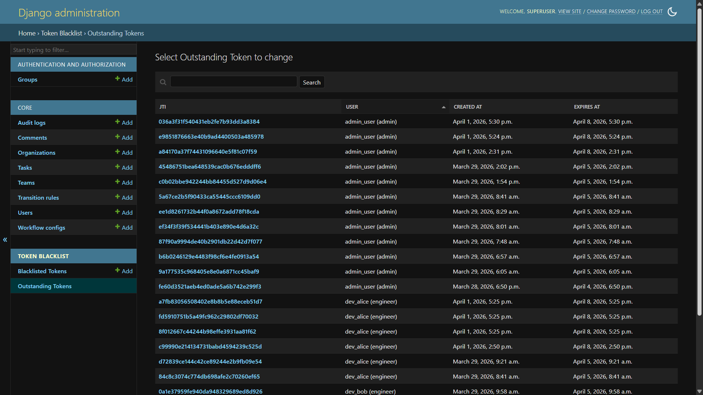
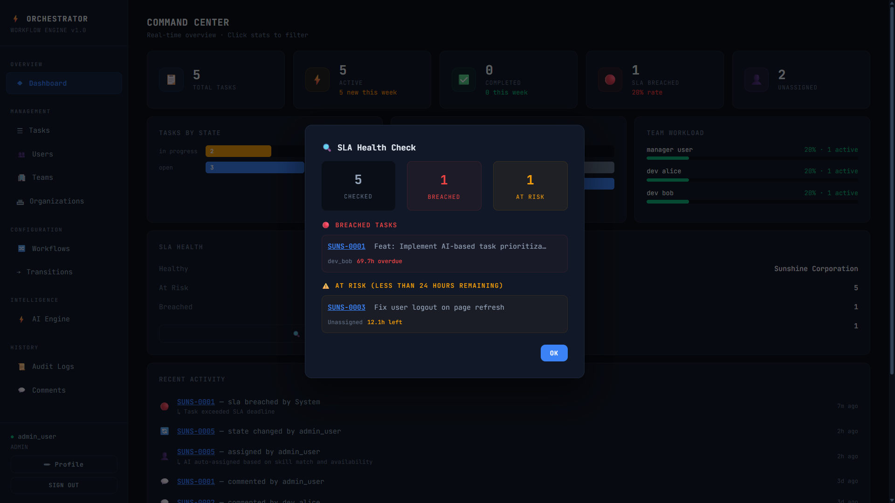

# ⚡ AI-Powered Work Orchestration Engine

> A production-grade AI-powered work orchestration engine with configurable workflows, role-based access control, SLA tracking, and intelligent task routing — built with Django, Django REST Framework, and PostgreSQL. Designed to handle real-world enterprise use cases like task lifecycle management, workflow enforcement, and data-driven decision making.
>
> Open source, contributions welcome.

This is what makes this project production-ready and easily adaptable:

- **Zero setup complexity** — No code changes, no editing Python files, and no redeployment required.
- **Instant onboarding** — A new organization can configure roles, priorities, task types, workflows, and admin accounts through a single API call.
- **Flexible and configurable** — System behavior can be adjusted without modifying core logic.
- **Open-source and extensible** — The codebase is well-structured, making it easy to **add, remove, or modify features** as needed.
- **Easy to enhance** — Developers can extend capabilities such as **AI logic, workflows, or business rules** with minimal friction.


---

## 📌 Table of Contents

- [What Makes This System Strong](#what-makes-this-system-strong)
- [What This Project Does](#-what-this-project-does)
- [Tech Stack](#-tech-stack)
- [System Architecture](#-system-architecture)
- [Database Design (8 Interconnected Models)](#-database-design-8-interconnected-models)
- [Backend Deep Dive](#-backend-deep-dive)
- [AI Engine — The Intelligence Layer](#-ai-engine--the-intelligence-layer)
- [JWT Authentication — How It Works](#-jwt-authentication--how-it-works)
- [Complete API Documentation](#-complete-api-documentation)
- [Django Admin Panel](#-django-admin-panel)
- [DRF Browsable API](#-drf-browsable-api)
- [Frontend Dashboard](#-frontend-dashboard)
- [Getting Started (Step-by-Step)](#-getting-started-step-by-step)
- [Project Structure](#-project-structure)
- [Error Handling](#-error-handling)
- [Configuration Reference](#-configuration-reference)
- [How to Integrate This Into Your Own Project](#-how-to-integrate-this-into-your-own-project)
- [Screenshots](#-screenshots)
- [Contributing](#-contributing)
- [License](#-license)

---

## 🏆 What Makes This System Strong

This project is built with a strong focus on real-world engineering practices, with every layer designed to reflect modern product-driven standards.
It emphasizes scalability, maintainability, and extensibility to deliver a robust, production-ready system.

### Real System Design, Not Just Endpoints

This project implements a **complete workflow orchestration system** with 8 interconnected database models, **20+ API endpoints with filtering, pagination, and search capabilities, and a layered architecture** that separates HTTP handling from business logic from data access. The system also supports complex queries such as filtering tasks by priority, team, and sorting — all handled efficiently within a single request.

### Configurable State Machine with Business Rule Enforcement

At the core of the system is a finite state machine that manages task workflows. Workflows are configurable — organizations can define their own states (e.g., open → in_progress → review → testing → done), transition rules (e.g., only managers can approve certain stages), and business constraints (e.g., tasks must be assigned before starting).
Each state change is validated against multiple rules before execution, and every transition is recorded in an immutable audit log for traceability.

### Dual-Layer Role-Based Access Control (RBAC)

Authorization is enforced at **two independent levels** - The first layer operates at the API level, controlling which endpoints each role can access (e.g., only admins can delete tasks). The second layer operates at the business logic level, ensuring users can only perform actions permitted by workflow rules.
Even if a user can access an endpoint, specific operations (like certain state transitions) are validated separately, ensuring consistent and secure access control throughout the system.

### AI-Powered Intelligence Layer (Zero Cost, Fully Local)

The AI engine runs entirely on the local machine, with no external APIs, no cloud services, and no subscriptions. It includes a multi-factor priority scoring system that evaluates urgency keywords, task type, manual priority, deadline proximity, and task age to generate a score between 0.0 and 1.0, along with a human-readable explanation.
It also provides an intelligent task routing system that ranks engineers based on skill match, current workload, and historical performance. In addition, a natural language query engine allows users to fetch tasks using plain English queries, which are converted into precise database filters using pattern matching.

### Enterprise-Grade Audit Trail

Every action in the system — task creation, state transitions, assignments, comments, and SLA breaches — is recorded in an immutable audit log with the exact old value, new value, actor, timestamp, and context.
These logs cannot be modified or deleted through the API, including by administrators, ensuring a complete and tamper-proof history of all changes.

### Multi-Tenant Data Isolation

Every database query in the system is automatically filtered by organization. A user from Organization A can never see, modify, or even discover the existence of data belonging to Organization B — even if they know the exact UUID of a resource. This multi-tenancy pattern is how SaaS platforms like Slack, Jira, and Salesforce keep customer data completely separated within a shared infrastructure.

### Production-Ready Authentication

The system uses JWT (JSON Web Token) authentication with a complete token lifecycle. Login provides an access token (short-lived) and a refresh token (long-lived), allowing users to renew sessions without re-entering credentials.
Refresh tokens are rotated on each use, and logout blacklists tokens permanently, ensuring they cannot be reused and maintaining secure session management. This is the exact same authentication pattern used by every modern API — from GitHub to Stripe to Google.

### SLA Monitoring and Breach Detection

Tasks can have deadlines, and the system actively monitors them. The SLA service identifies overdue tasks, flags tasks that are at risk (e.g., less than 24 hours remaining), calculates breach rates per organization, and logs each breach as an audit event.
These checks can be triggered via API, CLI, or scheduled as a background job, enabling continuous and automated monitoring.

---

## 🧠 What This Project Does

This project is the backend engine of a work management system — responsible for managing tasks, enforcing rules, controlling access, and tracking state changes.

Every task operates within a state machine, ensuring that actions follow defined workflows. The system enforces rules such as requiring assignment before starting work or restricting approvals based on roles, preventing invalid operations.

On top of this, an AI layer enhances decision-making. It evaluates task details like title, type, deadline, and age to calculate priority scores, suggests optimal assignees based on skills and workload, and supports natural language queries to fetch tasks using simple English.

All actions — including state changes, assignments, and updates — are recorded in an immutable audit log with complete traceability.

**In short**: Tasks are created, validated, assigned, processed through workflows, monitored for deadlines, intelligently prioritized, and fully tracked — ensuring consistency and reliability across the system.

---


## 🔧 Zero-Code Organization Setup — The Heart of This Engine

This is what makes this project **production-ready for any company**. No code changes. No editing Python files. No redeployment. A new organization can set up their entire system — custom roles, priorities, task types, workflows, and admin account — with **a single API call**.

Every piece of configuration that most systems hardcode into their source code is **fully dynamic** in this engine:

| What's Dynamic | Example | How It's Configured |
|---|---|---|
| **Roles** | `admin`, `delivery_manager`, `tech_lead`, `developer`, `qa_engineer` | Defined per organization via API or admin panel |
| **Priority Levels** | `p0_blocker`, `p1_critical`, `p2_major`, `p3_minor` | Defined per organization — not locked to critical/high/medium/low |
| **Task Types** | `user_story`, `defect`, `spike`, `tech_debt`, `change_request` | Defined per organization — not locked to bug/feature/task |
| **Workflow States** | `backlog → sprint_ready → in_dev → code_review → qa → uat → deployed` | Fully configurable per workflow |
| **Transition Rules** | "Only `tech_lead` and above can move tasks from `code_review` to `qa`" | Created via API — no code needed |
| **Teams, Users, Tasks** | Everything else | All managed via API endpoints |

### Why This Matters

Most workflow tools force you into their terminology — their states, their roles, their priority names. If your company calls priorities "P0/P1/P2/P3" instead of "Critical/High/Medium/Low," you're stuck. If your engineering team uses roles like "Staff Engineer" and "Principal" instead of "Engineer" and "Manager," you have to fork the code and modify it.

**This engine adapts to your company.** Your company doesn't adapt to the engine.

### One-Click Setup API

The `/api/v1/setup/` endpoint creates everything a new organization needs in a single request:

For the complete API reference with every endpoint, request/response examples, curl commands, error codes, and a full step-by-step lifecycle walkthrough, see:

**[📖 Complete API Reference →](API_REFERENCE.md)**

**What it creates automatically:**
- Organization with custom roles, priorities, and task types
- Admin user with JWT tokens (ready to use immediately)
- Default workflow with the states you define
- Auto-generated transition rules (sequential flow + revert + cancellation + reopen)
- Optional team with the admin as lead

### Example 1 — Enterprise Engineering Team

A large engineering division wants an agile delivery workflow with custom roles and P0-P3 priority levels:
```json
POST /api/v1/setup/

{
    "org_name": "NovaSphere Engineering",
    "org_slug": "novasphere",
    "admin_username": "nova_admin",
    "admin_password": "securepass2026",
    "admin_email": "admin@novasphere.io",
    "roles": [
        "admin",
        "delivery_manager",
        "tech_lead",
        "developer",
        "qa_engineer",
        "viewer"
    ],
    "priorities": ["p0_blocker", "p1_critical", "p2_major", "p3_minor"],
    "task_types": ["defect", "user_story", "spike", "tech_debt", "change_request"],
    "workflow_name": "Agile Delivery Pipeline",
    "workflow_states": [
        "backlog",
        "sprint_ready",
        "in_development",
        "code_review",
        "qa_testing",
        "uat",
        "deployed",
        "cancelled"
    ],
    "initial_state": "backlog",
    "final_states": ["deployed", "cancelled"],
    "team_name": "Platform Engineering"
}
```

**Response — everything ready to use:**
```json
{
    "message": "Organization 'NovaSphere Engineering' created successfully!",
    "organization": {
        "id": "a1b2c3d4-...",
        "name": "NovaSphere Engineering",
        "slug": "novasphere",
        "allowed_roles": ["admin", "delivery_manager", "tech_lead", "developer", "qa_engineer", "viewer"],
        "allowed_priorities": ["p0_blocker", "p1_critical", "p2_major", "p3_minor"],
        "allowed_task_types": ["defect", "user_story", "spike", "tech_debt", "change_request"]
    },
    "admin_user": {
        "id": "e5f6g7h8-...",
        "username": "nova_admin",
        "role": "admin"
    },
    "workflow": {
        "id": "i9j0k1l2-...",
        "name": "Agile Delivery Pipeline",
        "states": ["backlog", "sprint_ready", "in_development", "code_review", "qa_testing", "uat", "deployed", "cancelled"],
        "initial_state": "backlog",
        "final_states": ["deployed", "cancelled"],
        "transitions_created": 15
    },
    "team": {
        "id": "m3n4o5p6-...",
        "name": "Platform Engineering"
    },
    "tokens": {
        "access": "eyJhbGciOiJIUzI1NiIs...",
        "refresh": "eyJhbGciOiJIUzI1NiIs..."
    }
}
```

The admin can immediately use the `access` token to start creating users, assigning roles, and managing tasks — zero additional setup.

### Example 2 — Small Startup (Minimal Setup)

A 5-person startup wants something simple — just three priorities, four roles, and a lightweight workflow:
```json
POST /api/v1/setup/

{
    "org_name": "CloudPeak Labs",
    "org_slug": "cloudpeak",
    "admin_username": "ceo_sarah",
    "admin_password": "launchday2026",
    "roles": ["admin", "lead", "dev", "intern"],
    "priorities": ["urgent", "normal", "someday"],
    "task_types": ["feature", "bugfix", "chore"],
    "workflow_states": ["todo", "building", "review", "shipped", "dropped"],
    "initial_state": "todo",
    "final_states": ["shipped", "dropped"]
}
```

### Example 3 — IT Support Desk

A corporate IT team wants to track support tickets with escalation levels:
```json
POST /api/v1/setup/

{
    "org_name": "Meridian Corp IT",
    "org_slug": "meridian-it",
    "admin_username": "it_head",
    "admin_password": "support2026secure",
    "roles": ["admin", "supervisor", "l2_support", "l1_support", "requester"],
    "priorities": ["sev1_outage", "sev2_degraded", "sev3_minor", "sev4_cosmetic"],
    "task_types": ["incident", "service_request", "change", "problem"],
    "workflow_name": "ITIL Incident Flow",
    "workflow_states": [
        "reported",
        "triaged",
        "investigating",
        "pending_vendor",
        "resolved",
        "closed"
    ],
    "initial_state": "reported",
    "final_states": ["resolved", "closed"],
    "team_name": "L2 Support Team"
}
```

### After Setup — What Comes Next

Once the organization is created, the admin uses their JWT tokens to:

1. **Create users** → `POST /api/v1/users/` with any role from the org's `allowed_roles`
2. **Create teams** → `POST /api/v1/teams/` and assign members
3. **Create tasks** → `POST /api/v1/tasks/` with priorities and types from the org's config
4. **Manage workflows** → Add more transition rules via `POST /api/v1/transitions/`
5. **Use the dashboard** → Login at `http://your-server/` to see everything visually

All validation is automatic — if a user tries to create a task with a priority that doesn't exist in their org's config, the API returns:
```json
{
    "priority": "Invalid priority 'critical'. Allowed: ['p0_blocker', 'p1_critical', 'p2_major', 'p3_minor']"
}
```

The system guides users toward the correct values without anyone reading documentation.

### Configuration via Admin Panel

Organizations can also be configured through Django's admin panel at `/admin/`. The Organization edit page shows three editable JSON fields — `allowed_roles`, `allowed_priorities`, and `allowed_task_types` — that can be modified at any time.


---

---


---

## 🛠 Tech Stack

| Layer | Technology | Why This Choice |
|---|---|---|
| **Backend Framework** | Django 5.x | Battle-tested, built-in ORM, admin panel, migrations — used by Instagram, Pinterest, Mozilla |
| **API Layer** | Django REST Framework | Industry standard for building RESTful APIs in Python |
| **Database** | PostgreSQL | The most advanced open-source relational database — used by every major product company |
| **Authentication** | SimpleJWT | JSON Web Token auth with access/refresh token pattern — the modern standard for API auth |
| **AI/ML** | scikit-learn, NLTK | Lightweight ML libraries — no expensive GPU or paid API needed |
| **API Filtering** | django-filter | Declarative filtering on API endpoints |
| **CORS** | django-cors-headers | Allows frontend to communicate with backend across different origins |
| **Secrets Management** | python-dotenv | Environment variables for sensitive config — never commit passwords to Git |

> **📝 A Note on the Frontend:** This is a backend-focused project. The frontend dashboard was built purely to demonstrate the backend's capabilities visually — it is written entirely in a **single HTML file** (`frontend/dashboard.html`) using vanilla HTML, CSS, and JavaScript with zero build tools, zero frameworks, and zero dependencies. This was intentional. Developers integrating this engine can **replace, modify, or completely remove** the frontend without affecting any backend functionality. The backend API is the product — the frontend is just a window into it.

---

## 🏗 System Architecture

```
┌─────────────────────────────────────────────────────────────────────┐
│                        CLIENT LAYER                                 │
│   ┌──────────────┐   ┌──────────────┐   ┌──────────────────────┐    │
│   │   Frontend   │   │   DRF        │   │   Any External App   │    │
│   │   Dashboard  │   │   Browsable  │   │   (Mobile, CLI,      │    │
│   │   (HTML/JS)  │   │   API        │   │    Postman, curl)    │    │
│   └──────┬───────┘   └──────┬───────┘   └──────────┬───────────┘    │
└──────────┼──────────────────┼──────────────────────┼───────────────-┘
           ▼                  ▼                       ▼
    ┌──────────────────────────────────────────────────────────┐
    │              JWT AUTHENTICATION LAYER                    │
    │     Access Token (1 hour) + Refresh Token (7 days)       │
    │         Token Rotation + Blacklisting on Logout          │
    └────────────────────────┬─────────────────────────────────┘
                             ▼
    ┌──────────────────────────────────────────────────────────┐
    │                    API LAYER (20+ REST Endpoints)        │
    │  /tasks/ /users/ /teams/ /workflows/ /transitions/       │
    │  /comments/ /audit-logs/ /dashboard/ /ai/                │
    └────────────────────────┬─────────────────────────────────┘
                             ▼
    ┌──────────────────────────────────────────────────────────┐
    │               PERMISSION LAYER (Dual RBAC)               │
    │  Layer 1: API Level — "Can this user hit this endpoint?" │
    │  Layer 2: Business — "Can this role do this action?"     │
    └────────────────────────┬─────────────────────────────────┘
                             ▼
    ┌──────────────────────────────────────────────────────────┐
    │                  SERVICE LAYER                           │
    │  StateMachineService │ SLAService │ DashboardService     │
    └────────────────────────┬─────────────────────────────────┘
                             ▼
    ┌──────────────────────────────────────────────────────────┐
    │                   AI ENGINE                              │
    │  PriorityScorer │ TaskRouter │ NLQueryEngine             │
    └────────────────────────┬─────────────────────────────────┘
                             ▼
    ┌──────────────────────────────────────────────────────────┐
    │                   DATA LAYER (8 Models)                  │
    │  Organization │ User │ Team │ WorkflowConfig             │
    │  TransitionRule │ Task │ Comment │ AuditLog              │
    └────────────────────────┬─────────────────────────────────┘
                             ▼
                    ┌─────────────────┐
                    │   PostgreSQL    │
                    └─────────────────┘
```

---

## 🗄 Database Design (8 Interconnected Models)

All models use **UUIDs** as primary keys instead of auto-incrementing integers — this is a security best practice because sequential IDs leak information.


### Model Relationships

```
Organization (1)
  ├── has many → User (N)
  │               ├── created → Task (N)
  │               ├── assigned to → Task (N)
  │               ├── leads → Team (N)
  │               └── performed → AuditLog (N)
  ├── has many → Team (N)
  │               └── has many → Task (N)
  ├── has many → WorkflowConfig (N)
  │               └── has many → TransitionRule (N)
  └── has many → Task (N)
                  ├── has many → Comment (N)
                  └── has many → AuditLog (N)
```

### Key Model Details

**Organization** — Top-level entity. Every piece of data belongs to an organization (multi-tenancy). Fields: `id` (UUID), `name`, `slug` (used for task key prefix like SUNS-0001).

**User** — Extends Django's built-in user. Fields: `role` (admin/manager/engineer/viewer), `skills` (JSON array like `["python", "django"]`), `max_concurrent_tasks` (workload limit, default 5).

**WorkflowConfig** — Defines the state machine. Fields: `allowed_states` (JSON array), `initial_state`, `final_states` (JSON array). Example: states `["open", "in_progress", "review", "testing", "done", "cancelled"]` with initial `"open"` and finals `["done", "cancelled"]`.

**TransitionRule** — Controls who can move tasks between states. Fields: `from_state`, `to_state`, `allowed_roles` (JSON array). Example: `from: "review"`, `to: "testing"`, `roles: ["admin", "manager"]`.

**Task** — Core work item. Fields: `task_key` (auto-generated like SUNS-0001), `current_state`, `priority`, `task_type`, `tags` (JSON), `due_date`, `sla_breached`, `ai_priority_score`, `ai_estimated_hours`, `resolved_at`.

**AuditLog** — Immutable record. Fields: `action` (created/state_changed/assigned/commented/sla_breached), `old_value` (JSON), `new_value` (JSON), `reason`. Cannot be edited or deleted via API.

---

## 🔧 Backend Deep Dive

### 1. Design Patterns Used

**State Machine Pattern** — The `StateMachineService` acts as a finite automaton controller. Tasks can only transition between states that are explicitly defined in `TransitionRule`.

**Service Layer Pattern** — Business logic is separated from views into dedicated service classes. Views only handle HTTP request/response. This makes the code testable, reusable, and maintainable.

**Repository Pattern** (via Django ORM) — Database queries are abstracted through Django's ORM. The code never writes raw SQL.

**Serializer Pattern** (via DRF) — Separate serializers for different use cases: `TaskListSerializer` (lightweight, for list views) vs `TaskDetailSerializer` (full data, for single task views).

### 2. State Machine Engine


**How a transition works internally:**

```
User: POST /tasks/{id}/transition/ {"to_state": "in_progress"}
                    │
                    ▼
  Check 1: Same state? → FAIL
  Check 2: Valid state in workflow? → FAIL
  Check 3: Transition rule exists? → FAIL
  Check 4: User role allowed? → FAIL
  Check 5: Task assigned? (if going to in_progress) → FAIL
                    │
              ALL PASSED ✅
                    │
  → Update task.current_state
  → Set resolved_at if final state
  → Create AuditLog entry
  → Return updated task
```

**Default Workflow:**

```
  [OPEN] → [IN_PROGRESS] → [REVIEW] → [TESTING] → [DONE]
    │           │                                      │
    ▼           ▼                                      ▼
 [CANCELLED] [CANCELLED]                     [OPEN] (reopen, admin only)
```

### 3. Role-Based Access Control (RBAC)


**Layer 1 — API Endpoint Level:**

| Action | Admin | Manager | Engineer | Viewer |
|---|:---:|:---:|:---:|:---:|
| View tasks/users/teams | ✅ | ✅ | ✅ | ✅ |
| Create tasks | ✅ | ✅ | ✅ | ❌ |
| Update any task in org | ✅ | ✅ | ❌ | ❌ |
| Delete tasks | ✅ | ❌ | ❌ | ❌ |
| Create users | ✅ | ✅ | ❌ | ❌ |
| Manage workflows/transitions | ✅ | ❌ | ❌ | ❌ |

*Managers can create all roles except Admin.*

**Layer 2 — Business Logic Level (State Transitions):**

| Transition | Admin | Manager | Engineer |
|---|:---:|:---:|:---:|
| open → in_progress | ✅ | ✅ | ✅ |
| open → cancelled | ✅ | ✅ | ❌ |
| in_progress → review | ✅ | ✅ | ✅ |
| review → testing | ✅ | ✅ | ❌ |
| testing → done | ✅ | ✅ | ❌ |
| done → open (reopen) | ✅ | ❌ | ❌ |

**Why two layers?** An engineer might have API access to "update a task" (Layer 1), but the state machine still prevents them from moving a task from "review" to "done" (Layer 2). This is **defense in depth**.

### 4. Immutable Audit Trail


Every action creates an `AuditLog` with: what happened, who did it, when, what changed (old → new as JSON), and why. Audit logs are **read-only** — no update or delete operations exist, not even for admins.

### 5. SLA Breach Detection

Tasks with a `due_date` are monitored. The `SLAService` flags overdue tasks as `sla_breached = True`, identifies at-risk tasks (< 24 hours remaining), and creates audit entries for each breach. Triggerable via API or CLI command.

---

## 🤖 AI Engine — The Intelligence Layer

Runs entirely locally — no paid APIs, no cloud services, no subscriptions.

### 1. Priority Scoring (5 Weighted Factors)


The AI evaluates the task and assigns a priority score, which is then reflected on the task for better decision-making.

| Factor | Weight | Example |
|---|---|---|
| **Keyword analysis** | 35% | "crash", "security", "blocker" → high score |
| **Task type** | 15% | Bugs score 0.8, features score 0.5 |
| **Manual priority** | 15% | Aligns with human-set priority |
| **Deadline proximity** | 20% | Overdue → 1.0, 24h left → 0.8, 1 week → 0.3 |
| **Task age** | 15% | Older unresolved tasks score higher |

Score interpretation: 🔴 70-100% = CRITICAL, 🟡 40-70% = MEDIUM/HIGH, 🟢 0-40% = LOW

### 2. Intelligent Task Routing


Ranks engineers by: **Skill match** (40%) — task tags vs user skills, **Workload** (30%) — fewer active tasks = higher score, **Past performance** (30%) — SLA compliance + resolution speed on similar tasks — and auto-assigns the best match on action.

### 3. Natural Language Queries


Type plain English → get database results. Examples: `"critical bugs"`, `"unassigned tasks"`, `"tasks assigned to dev_alice"`, `"overdue tasks"`, `"my tasks"`.

---

## 🔐 JWT Authentication — How It Works

JWT (JSON Web Token) is the industry-standard way to authenticate API requests. Here is a beginner-friendly explanation:

### The Problem

APIs are **stateless** — the server does not remember anything between requests. Every API call is independent. So how does the server know who you are?

### The Solution: Tokens

When you log in, the server gives you two tokens — think of them as temporary ID cards:

**Access Token** — Your main ID card. You show it with every request. It expires in 1 hour for security. If someone steals it, they can only use it for 1 hour.

**Refresh Token** — A backup card to get a new access token without logging in again. It lasts 7 days.

### How It Works Step-by-Step

```
Step 1: LOGIN
   You send: POST /auth/login/ {"username": "admin_user", "password": "testpass123"}
   Server returns: {"access": "eyJhbG...", "refresh": "eyJhbG..."}

Step 2: USE THE ACCESS TOKEN
   You send: GET /tasks/
   Header: Authorization: Bearer eyJhbG...
   Server decodes the token → finds your user ID → returns your tasks

Step 3: TOKEN EXPIRES (after 1 hour)
   You send: POST /auth/refresh/ {"refresh": "eyJhbG..."}
   Server returns: {"access": "NEW_TOKEN_HERE"}

Step 4: LOGOUT
   You send: POST /auth/logout/ {"refresh": "eyJhbG..."}
   Server blacklists the refresh token → it can never be used again
```

### 🔐 JWT Authentication Flow (Visual Timeline)

JWT authentication works seamlessly in the background — ensuring secure, stateless, and efficient API communication without repeatedly querying the database for every request.

### 🕒 Example Timeline

- **⏱️ Time 0:00 — LOGIN**
  - Send: username + password  
  - Receive: access token (1 hour) + refresh token (7 days)  

- **⏱️ Time 0:01 — CREATE TASK**
  - Send: access token + task data  
  - Server decodes token → identifies user → checks role → creates task ✅  

- **⏱️ Time 0:05 — ASSIGN TASK**
  - Send: access token + user_id  
  - Server decodes token → verifies permissions → assigns task ✅  

- **⏱️ Time 0:30 — TRANSITION TASK**
  - Send: access token + target state  
  - Server decodes token → validates role → enforces workflow → transitions task ✅  

- **⏱️ Time 1:00 — ACCESS TOKEN EXPIRES**
  - Send: access token  
  - Server rejects request → `401 Unauthorized` ❌  

- **⏱️ Time 1:01 — REFRESH TOKEN**
  - Send: refresh token  
  - Receive: new access token (valid for another 1 hour)  

- **⏱️ Time 1:02 — BACK TO WORK**
  - Send: new access token  
  - Requests succeed again ✅  

- **⏱️ Logout — TOKEN INVALIDATION**
  - Send: refresh token  
  - Token is blacklisted → cannot be reused ❌  


- **Outstanding Tokens** — All refresh tokens that have been issued and are still recognized by the system. They represent active user sessions and are tracked to manage authentication lifecycle and token validity.

- **Blacklisted Tokens** — Refresh tokens that have been explicitly invalidated (on logout or rotation). These tokens are permanently blocked and cannot be used again, ensuring secure session handling and preventing reuse.

---

## ⚡ Why JWT is Important in This Project

- Runs completely **in the background** — no manual session handling  
- **Stateless authentication** — no server-side session storage  
- **High performance** — avoids repeated database lookups for every request  
- **Secure** — short-lived access tokens + refresh mechanism  
- **Scalable** — ideal for API-first and distributed systems  

---

## 🚀 Role in the System

JWT plays a **critical role** in:

- 🔐 Securing all API endpoints  
- 👥 Enforcing role-based access control (RBAC)  
- 🔄 Validating workflow transitions  
- ⚡ Enabling fast, efficient request processing  

Every request is authenticated using tokens — making the system **secure, scalable, and production-ready**.


### Authentication Endpoints

| Endpoint | Method | Who Can Access | What It Does |
|---|---|---|---|
| `/auth/login/` | POST | Anyone (no token needed) | Send username + password, get tokens |
| `/auth/register/` | POST | Anyone (no token needed) | Create account + get tokens |
| `/auth/refresh/` | POST | Anyone with valid refresh token | Get new access token |
| `/auth/logout/` | POST | Logged-in users | Blacklist refresh token permanently |

---

## 📡 Complete API Documentation

For the complete API reference with every endpoint, request/response examples, curl commands, error codes, and a full step-by-step lifecycle walkthrough, see:

**[📖 Complete API Reference →](API_REFERENCE.md)**

**Quick overview of available endpoints:**

| Category | Endpoints | Key Actions |
|---|---|---|
| **Setup** | `POST /setup/` | One-click org creation with custom config |
| **Auth** | `/auth/login/` `/auth/register/` `/auth/refresh/` `/auth/logout/` | JWT token lifecycle |
| **Organizations** | `/organizations/` | CRUD + dynamic config |
| **Users** | `/users/` `/users/me/` | CRUD + profile management |
| **Teams** | `/teams/` | CRUD + member management |
| **Workflows** | `/workflows/` | State machine configuration |
| **Transitions** | `/transitions/` | Who can move tasks between states |
| **Tasks** | `/tasks/` `/tasks/{id}/transition/` `/tasks/{id}/assign/` | CRUD + state changes + assignment |
| **Comments** | `/comments/` | Task discussions |
| **Audit Logs** | `/audit-logs/` | Immutable history (read-only) |
| **Dashboard** | `/dashboard/overview/` `/dashboard/sla-check/` | Analytics + SLA monitoring |
| **AI Engine** | `/ai/score-priority/` `/ai/recommend-assignee/` `/ai/query/` | Scoring, routing, natural language |

---

## 🛡 Django Admin Panel


Django includes a powerful built-in admin panel at `/admin/`. This is a separate interface from the frontend dashboard — it gives you direct database access with full CRUD on all 8 models, search, filters, and inline editing.


---


Access it at `http://127.0.0.1:8000/admin/` with your superuser credentials.

---

## 🌐 DRF Browsable API


Django REST Framework provides a browser-based API interface at `/api/v1/`. You can browse all endpoints, send requests, and see formatted JSON responses — all from your browser.

---

---

---


---

## 🖥 Frontend Dashboard

The frontend is a single HTML file — no React build, no npm, no webpack. It communicates with the backend via the REST API using JWT tokens.

| Page | Features |
|---|---|
| **Dashboard** | Clickable cards, state/priority charts, team workload, SLA health, activity feed |
| **Tasks** | Search, filter (state/priority/team), sort columns, pagination, create/edit/delete, inline AI scoring |
| **Users** | List with roles/skills/capacity bars, create/delete users |
| **Teams** | Cards with lead/members, create/edit/delete |
| **Organizations** | Details with counts, create/edit |
| **Workflows** | State machine visualization, create/edit/delete |
| **Transitions** | Rule table, create/delete |
| **AI Engine** | NL query, priority scoring, smart routing, auto-assign |
| **Audit Logs** | Card layout with old/new values, clickable task links |
| **Comments** | Sorted recent-first, clickable task navigation |


---

## 🚀 Getting Started (Step-by-Step)

### Prerequisites

| Software | Version | Download |
|---|---|---|
| Python | 3.10+ | [python.org](https://www.python.org/downloads/) |
| PostgreSQL | 17+ | [postgresql.org](https://www.postgresql.org/download/) |
| Git | Any | [git-scm.com](https://git-scm.com/downloads/) |

### Installation

```bash
# 1. Clone the repository
git clone https://github.com/adithyakrishhna/work-orchestration-engine.git
cd work-orchestration-engine

# 2. Create and activate virtual environment
python -m venv venv
# Windows: venv\Scripts\activate
# Mac/Linux: source venv/bin/activate

# 3. Install dependencies
pip install -r requirements.txt

# 4. Create .env file (see .env.example for reference)
# Add your PostgreSQL password and a secret key

# 5. Create the PostgreSQL database
psql -U postgres -c "CREATE DATABASE work_orchestration;"

# 6. Run migrations
python manage.py migrate

# 7. Create admin account
python manage.py createsuperuser

# 8. Load sample data
python manage.py seed_data

# 9. Start the server
python manage.py runserver
```

### Access Points

| URL | What You Will See |
|---|---|
| `http://127.0.0.1:8000/` | Frontend Dashboard (login page) |
| `http://127.0.0.1:8000/admin/` | Django Admin Panel |
| `http://127.0.0.1:8000/api/v1/` | DRF Browsable API |

### Test Credentials (after running seed_data)

| Username | Password | Role | What They Can Do |
|---|---|---|---|
| admin_user | testpass123 | Admin | Everything — full CRUD, all transitions, manage workflows |
| manager_user | testpass123 | Manager | Assign tasks, create users, approve/reject work |
| dev_alice | testpass123 | Engineer | Work on assigned tasks, transition own tasks |
| dev_bob | testpass123 | Engineer | Work on assigned tasks, transition own tasks |
| viewer_user | testpass123 | Viewer | Read-only access to all data |

---

## 📁 Project Structure
```
work-orchestration-engine/
├── config/                          # Project configuration
│   ├── settings.py                  # Database, auth, REST, CORS, JWT settings
│   ├── urls.py                      # Root URL routing
│   ├── wsgi.py                      # WSGI server entry point
│   └── asgi.py                      # ASGI server entry point
│
├── core/                            # Main application (backend brain)
│   ├── models.py                    # 8 database models (Organization, User, Team,
│   │                                #   WorkflowConfig, TransitionRule, Task,
│   │                                #   Comment, AuditLog)
│   ├── admin.py                     # Django admin panel configuration
│   ├── urls.py                      # Core API URL routing
│   ├── auth_urls.py                 # Auth endpoint routing (login, register, logout)
│   │
│   ├── serializers/                 # JSON ↔ Python conversion layer
│   │   ├── __init__.py              # Exports all serializers
│   │   ├── organization.py          # Org serializer with dynamic config fields
│   │   ├── user.py                  # User + UserCreate with role validation
│   │   ├── team.py                  # Team with nested lead details
│   │   ├── workflow.py              # Workflow with nested transition rules
│   │   ├── task.py                  # TaskList (light) + TaskDetail (full) with
│   │   │                            #   dynamic priority/type validation
│   │   └── audit.py                 # Read-only, immutable audit serializer
│   │
│   ├── views/                       # API endpoint handlers
│   │   ├── __init__.py              # Exports all views
│   │   ├── organization.py          # Organization CRUD
│   │   ├── user.py                  # User CRUD + /me endpoint
│   │   ├── team.py                  # Team CRUD
│   │   ├── workflow.py              # Workflow + Transition CRUD
│   │   ├── task.py                  # Task CRUD + transition + assign endpoints
│   │   ├── audit.py                 # Read-only audit log listing
│   │   ├── dashboard.py             # Analytics, SLA check, team performance
│   │   ├── auth.py                  # Register + Logout views
│   │   └── setup.py                 # One-click organization setup endpoint
│   │
│   ├── permissions/                 # Access control layer
│   │   ├── __init__.py              # Exports all permissions
│   │   └── rbac.py                  # IsAdmin, IsManagerOrAbove,
│   │                                #   IsSameOrganization, TaskPermission
│   │
│   ├── services/                    # Business logic (separated from views)
│   │   ├── __init__.py              # Exports all services
│   │   ├── state_machine.py         # transition(), assign_task(),
│   │   │                            #   get_available_transitions()
│   │   ├── sla_service.py           # check_all_sla(), get_sla_summary()
│   │   └── dashboard_service.py     # get_overview(), get_team_performance(),
│   │                                #   get_recent_activity()
│   │
│   └── management/                  # Django CLI commands
│       └── commands/
│           ├── seed_data.py         # Populate sample data for testing
│           └── check_sla.py         # Run SLA breach check from terminal
│
├── ai_engine/                       # AI/ML intelligence module
│   ├── priority_scorer.py           # 5-factor weighted priority scoring engine
│   ├── task_router.py               # Skill + workload + performance matching
│   ├── nl_query.py                  # Natural language → database query parser
│   ├── views.py                     # AI API endpoints (score, route, query)
│   └── urls.py                      # AI URL routing
│
├── frontend/
│   └── dashboard.html               # Complete SPA dashboard (single file,
│                                    #   no build tools, no frameworks)
│
├── docs/
│   └── images/                      # Screenshots for documentation
│
├── .env                             # Your secrets — gitignored, never pushed
├── .env.example                     # Template showing required env variables
├── .gitignore                       # Files excluded from Git
├── manage.py                        # Django CLI entry point
├── requirements.txt                 # Python dependencies
├── LICENSE                          # MIT License
└── README.md                        # Project documentation
```

---

## ❌ Error Handling

All errors return clear, specific messages. In the frontend, errors appear as modal popups requiring user acknowledgment.


### State Machine Errors

| What You Tried | Error Message |
|---|---|
| Transition without assigning first | `"Task must be assigned to someone before moving to 'in_progress'."` |
| Invalid state path | `"Transition from 'open' to 'done' is not allowed in workflow 'Standard Bug Tracking'."` |
| Wrong role for transition | `"Your role 'engineer' cannot transition from 'review' to 'testing'. Allowed roles: ['admin', 'manager']"` |
| Already in target state | `"Task is already in 'open' state."` |
| Non-existent state | `"State 'invalid' is not valid for workflow 'Standard Bug Tracking'. Allowed states: [...]"` |

### Assignment Errors

| What You Tried | Error Message |
|---|---|
| Assign to overloaded user | `"dev_alice already has 5 active tasks (max: 5)."` |
| Assign across organizations | `"Cannot assign task to user from different organization."` |
| Engineer tries auto-assign | `"Only admins and managers can auto-assign tasks."` |

---

## ⚙ Configuration Reference

### Environment Variables (.env)

| Variable | Description |
|---|---|
| `DB_NAME` | PostgreSQL database name |
| `DB_USER` | Database username |
| `DB_PASSWORD` | Database password (**never commit this**) |
| `DB_HOST` | Database host (usually `localhost`) |
| `DB_PORT` | Database port (usually `5432`) |
| `SECRET_KEY` | Django secret key for cryptographic signing |

### Key Django Settings

| Setting | Value | Purpose |
|---|---|---|
| `ACCESS_TOKEN_LIFETIME` | 1 hour | JWT access token duration |
| `REFRESH_TOKEN_LIFETIME` | 7 days | JWT refresh token duration |
| `ROTATE_REFRESH_TOKENS` | True | New refresh token on each use |
| `BLACKLIST_AFTER_ROTATION` | True | Old refresh tokens invalidated |
| `PAGE_SIZE` | 20 | Default pagination size |

---

## 🔌 How to Integrate This Into Your Own Project

### Option 1: Use the REST API from any frontend
Any application that can make HTTP requests can use this backend — React, Vue, Angular, mobile apps, CLI tools.

### Option 2: Use as a Django app
Copy `core/` and `ai_engine/` into your Django project, add to `INSTALLED_APPS`, include URLs, run migrations.

### Option 3: Customize workflows
Create your own workflows through the API or admin panel. Define custom states, transitions, and role permissions for your specific use case (support tickets, manufacturing orders, patient tracking, etc.).

---

## 📸 Screenshots

### Backend — Django Admin Panel


*Django's built-in admin panel showing all 8 registered models — direct database access with search, filters, and inline editing.*

---


*Task list view in the admin panel — columns for task key, title, state, priority, assignee, and SLA status with built-in filtering sidebar.*

---


*Single task edit form in admin — every field is editable, auto-generated task key is read-only, timestamps are tracked automatically.*

---

### Backend — DRF Browsable API


*Django REST Framework's browsable API root — lists all available endpoints. Any developer can explore and test the API directly in the browser.*

---


*Tasks endpoint returning paginated JSON response — includes filtering, search, and ordering capabilities visible in the URL bar.*

---


*Single task detail via API — full JSON response showing all fields including nested comments, assignee details, AI scores, and timestamps.*

---

### Frontend — Dashboard


*JWT-authenticated login screen — credentials are verified against the backend, access and refresh tokens are issued and stored in sessionStorage.*

---


*Command center showing real-time analytics — clickable stat cards, task distribution by state and priority, team workload bars, SLA health, and recent activity feed.*

---


*SLA health check modal — shows breached tasks with hours overdue in red, at-risk tasks with hours remaining in amber, and clickable task keys for quick navigation.*

---

### Frontend — Task Management


*Task list with search bar, state/priority/team filters, sortable column headers, pagination, inline AI scoring, and admin delete buttons.*

---


*Task detail panel — shows all task info, edit section (priority, due date, team, tags), assign dropdown with workload info, state transition buttons, and comments thread.*

---


*Task creation form — title, description, priority, type, workflow, team, due date, and tags. Priority and type options are dynamically loaded from the organization's configuration.*

---


*State transition confirmation — validates 5 business rules before allowing the change. Shows a reason field for audit trail documentation.*

---

### Frontend — AI Engine


*AI priority scoring breakdown — 5 weighted factors (keywords 35%, type 15%, priority 15%, deadline 20%, age 15%) with visual bars showing each factor's contribution, and once the score is generated, it is automatically reflected on the task.*

---


*Intelligent task routing — engineers ranked by skill match, workload availability, and past performance with human-readable reasoning for each recommendation.*

---


*Natural language query engine — plain English input converted to database filters. Shows parsed filters as badges and matching tasks in a results table.*

---

### Frontend — Management


*User management — lists all users with roles, skill tags, active task count, and capacity utilization bars. Admins and managers can create new users with role validation.*

---


*Team management — cards showing team lead, members, and member count. Admins can create, edit (change lead, add/remove members), and delete teams.*

---


*Organization settings — displays org name, slug, member count, and team count. Admins can edit details and create new organizations.*

---


*Workflow configuration — visualizes the state machine with initial (▶) and final (■) state markers, and lists all transition rules with their allowed roles.*

---


*Transition rules table — shows every from→to state pair with color-coded allowed roles. Admins can create new rules and delete existing ones.*

---

### Frontend — History and Errors


*Immutable audit trail — every action recorded with old/new values displayed side by side, performer name, timestamp, and reason. Task keys are clickable for navigation.*

---


*Comments feed — all comments across tasks sorted recent-first. Shows author, content, and time ago. Task keys are clickable to navigate directly to the task.*

---


*Error handling — business rule violations shown as modal popups with clear error messages. User must acknowledge by clicking OK — errors never flash and disappear.*

---


*Profile editor — users can update their email, skills (used by AI for task routing), and max concurrent tasks (used for workload calculations).*

---


*Responsive design — sidebar collapses into a hamburger menu on mobile, grids stack to single column, tables get horizontal scroll. Works on desktop, tablet, and phone.*

---

## 🤝 Contributing

Contributions are welcome! To get started:

1. Fork the repository  
2. Create a new branch: `git checkout -b feature/your-feature-name`  
3. Make your changes and commit: `git commit -m "feat: add your feature"`  
4. Push to your fork: `git push origin feature/your-feature-name`  
5. Open a Pull Request and describe your changes clearly  

---

## 📄 License

MIT License — see [LICENSE](LICENSE) for details.

---

**Built by [Adithya Krishna](https://github.com/adithyakrishhna)** — *⭐ Star this repo if you appreciate this production-grade backend engineering.!*